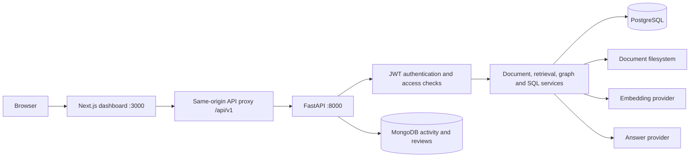

# KnowledgeSphere AI

**Enterprise knowledge management, permission-aware retrieval, and database analytics.**

[Repository](https://github.com/sashank321/A7_DBMS_40_126_267) · [Google Docs Manual](https://docs.google.com/document/d/1mjqDBszHFOaiXsHcvgY31GVWjq0ggz-W58rm9a5IGdA/edit?usp=sharing) · [Markdown Manual](docs/KNOWLEDGESPHERE_OPERATIONS_MANUAL.md)

KnowledgeSphere AI combines a Next.js dashboard, a FastAPI backend, a normalized PostgreSQL data model, MongoDB telemetry, local semantic embeddings, a relational knowledge graph, and permission-filtered question answering.

The active application uses **`app.main:app`** for the backend and **`frontend/`** for the web interface. The root-level `main.py`, `model.py`, `frontend_legacy/`, and older AllocFlow routes are historical components rather than the primary startup path.

## Capabilities

| Module | Implemented behavior |
| --- | --- |
| Document Explorer | Upload readable text, Markdown, PDF, and Word files; enter text directly; manage tags, document versions, downloads, deletion, and explicit user grants. |
| Semantic and hybrid search | Rank authorized document chunks using cosine similarity; match document metadata and tags; combine retrieval channels with reciprocal rank fusion. |
| RAG Copilot | Route questions to structured records, graph relationships, or authorized document retrieval. Return source citations for document retrieval answers. |
| Safe Text-to-SQL | Translate supported question patterns into SQL; validate the syntax tree; restrict tables and functions; scope records to user access; execute a read-only transaction with a statement timeout. |
| Knowledge Graph | Display typed entities and directed relationships with filtering, selection, connections, zoom controls, and source-based visibility. |
| MongoDB telemetry | Persist activity events and document reviews; calculate distributions, averages, and document review summaries. |
| Audit and access views | Display SQL audit records, audit analytics, and a computed user-document access matrix with role restrictions. |
| Live platform metadata | Show connected database versions, active embedding model details, catalog choices, saved permissions, and live counts. |

## Architecture



Embeddings are stored as PostgreSQL `FLOAT8[]` values. Similarity scoring currently runs in Python. The application does not use a pgvector index or a separate graph database.

## Access model

- **Admin:** full document access; user creation; audit analytics and access matrix.
- **Document owner:** view, edit, delete, and manage explicit permissions for owned documents.
- **Manager:** view and edit documents in the manager's department; selected administrative API capabilities.
- **Employee:** owned documents and explicit document grants.
- **Other access:** denied unless an applicable rule grants it.

Upload destinations are restricted to the uploader's own department except for Admin. Backend checks enforce access independently of visible UI controls. See the manual for rule precedence, Manager-specific caveats, and the differences between API access and navigation visibility.

## Requirements

| Component | Reference |
| --- | --- |
| Python | The current local integration was verified with Python 3.12 and a project virtual environment. |
| Node.js | The frontend container uses Node.js 20; a compatible local Node/npm installation is required. |
| PostgreSQL | A running server and an application database; the verified local server reports 18.4. |
| MongoDB | A running server and an application database; the verified local server reports 8.3.8. |
| Embedding model | Default `all-MiniLM-L6-v2`; initial model acquisition may require network access. |

These server versions describe the verified local environment, not universal minimum requirements. Docker Compose specifies different database image versions and has not been executed in the current verification environment.

## Local installation

### 1. Obtain the project

```powershell
git clone https://github.com/sashank321/A7_DBMS_40_126_267.git
Set-Location A7_DBMS_40_126_267
py -3.12 -m venv .venv
.\.venv\Scripts\python.exe -m pip install -r requirements.txt
Copy-Item .env.example .env
```

Edit the private `.env` with the actual PostgreSQL and MongoDB connection details. Set `JWT_SECRET` to a random value of at least 32 characters. Do not commit passwords, API keys, or the private environment file.

### 2. Prepare a new demonstration database

Ensure both database servers are running. Use a new, empty PostgreSQL application database before running:

```powershell
.\.venv\Scripts\python.exe scripts/init_db.py
.\.venv\Scripts\python.exe scripts/seed_ai_and_graph.py
```

**Data protection:** `init_db.py` skips an existing application schema. The raw schema SQL includes destructive `DROP TABLE` statements, and the seed script rewrites document content and rebuilds demo indexes. Do not use the seed script against an operational document library.

Fresh sample identities can differ from an already installed local database. Configure demo account discovery from actual records; do not assume the README contains universal account IDs or names.

### 3. Start the backend

From the repository root:

```powershell
.\.venv\Scripts\python.exe -m uvicorn app.main:app --host 127.0.0.1 --port 8000
```

### 4. Configure and start the frontend

In another terminal:

```powershell
Set-Location frontend
Copy-Item .env.example .env.local
npm ci
npm run build
npm start
```

For iterative development, use `npm run dev`. `BACKEND_INTERNAL_URL` defaults to `http://127.0.0.1:8000`; browser requests normally use the same-origin `/api/v1` proxy.

### 5. Open the application

| Destination | Local address |
| --- | --- |
| Landing page | `http://localhost:3000/` |
| Sign-in | `http://localhost:3000/login` |
| Dashboard | `http://localhost:3000/dashboard` |
| Backend health | `http://localhost:8000/api/v1/health` |
| Interactive API reference | `http://localhost:8000/api/v1/docs` |
| OpenAPI contract | `http://localhost:8000/api/v1/openapi.json` |

The model loads during backend startup. Wait for startup completion before checking the UI.

## Optional demo access

In the private backend `.env`, set `DEMO_ACCOUNT_EMAILS` to a JSON list of existing demonstration account emails. In `frontend/.env.local`, set `NEXT_PUBLIC_DEMO_PASSWORD` only to the password of deliberately public demo accounts. Rebuild the frontend after changing public settings.

Leave these settings empty to disable demo discovery and demo sign-in buttons. `NEXT_PUBLIC_` values are visible to browser users and must not contain production secrets. The optional background video is controlled by `NEXT_PUBLIC_LOGIN_VIDEO_URL`.

## Embedding and answer providers

| Setting | Values and behavior |
| --- | --- |
| `EMBEDDING_PROVIDER` | `sentence_transformers` for the default neural model; `deterministic`/`crc32` for development hashing; `openai` requires an API key. |
| `EMBEDDING_MODEL` | Default local model `all-MiniLM-L6-v2`; its actual dimensions are reported by health metadata. |
| `RAG_PROVIDER` | `extractive`, `local_llm`/`ollama`, `openai`, or `auto`. |
| `LOCAL_LLM_URL` | OpenAI-compatible local endpoint, default `http://localhost:11434/v1`. |
| `OPENAI_API_KEY` | Enables supported external embedding/answer providers when configured. |

The verified local configuration uses real 384-dimensional MiniLM embeddings. When no generative provider is available, RAG can return authorized source excerpts with citations. Extractive output is not a guarantee that source material is correct, current, complete, or relevant. Cloud providers and Docker deployment remain unverified in this environment.

Changing the embedding provider or model requires a controlled reindex of existing embeddings. Different vector dimensions cannot be compared meaningfully.

## Verification baseline

As of **4 October 2026**:

- **78 automated backend tests passed**, including authentication, document access, transaction rollback, file extraction, search, SQL restrictions, graph behavior, telemetry, and input validation.
- **24 live frontend-to-backend checks passed** against the local application.
- The frontend production build and TypeScript validation passed.
- Browser checks confirmed responsive document dialogs, visible upload errors, account synchronization across tabs, accessible graph selection, search, hero cursor movement, and the repository links.

The frontend build skips linting through the current Next.js configuration. A successful build therefore does not represent a successful lint run. Test results describe the inspected local working copy; they are not evidence of a published GitHub release or a production certification.

Run the tests only against an isolated fixture database. The current tests contain writes and expect particular sample identities and baseline records. Full instructions are in the manual.

## Repository layout

```text
app/                        Active FastAPI application
  api/v1/                   API routes
  core/                     Configuration and token/password utilities
  db/                       PostgreSQL and MongoDB connections
  models/                   SQLAlchemy relational models
  schemas/                  Request and response contracts
  services/                 Ingestion, retrieval, graph, SQL and provider logic
frontend/                   Next.js application and public assets
database/sql/college/       Active base schema and demonstration fixtures
database/sql/extensions/    AI tables, views, indexes and triggers
scripts/                    Initialization, seeding and maintenance helpers
tests/                      Backend regression and integration tests
docs/                       Engineering and Operations Manual
storage/documents/          Default uploaded file storage
```

## Production status and limitations

This is an integrated local prototype with verified workflows. Production release work includes restricted CORS, secure session handling, database least privilege, service monitoring, upload limits and scanning, deployment verification, migration management, backup/restore drills, pagination, and scale testing. The manual records implementation-specific gaps, including permission-view differences and graph edge visibility limits.

No throughput, availability, latency SLA, regulatory certification, or zero-hallucination guarantee is claimed.

## Documentation

Use [the complete manual](docs/KNOWLEDGESPHERE_OPERATIONS_MANUAL.md) for feature specifications, procedures, data design, API contracts, configuration, operations, troubleshooting, security boundaries, and release acceptance criteria.

License and redistribution terms are not established by this README; inspect the repository's applicable license material before redistribution.
