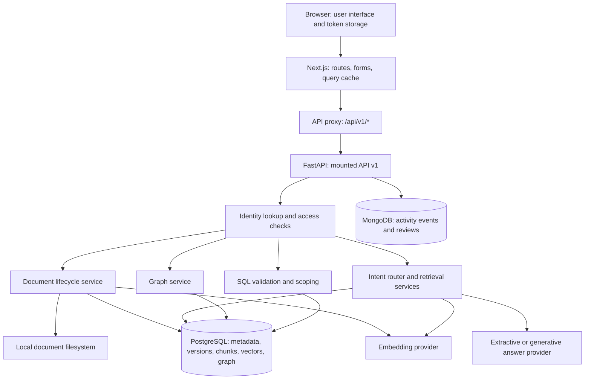
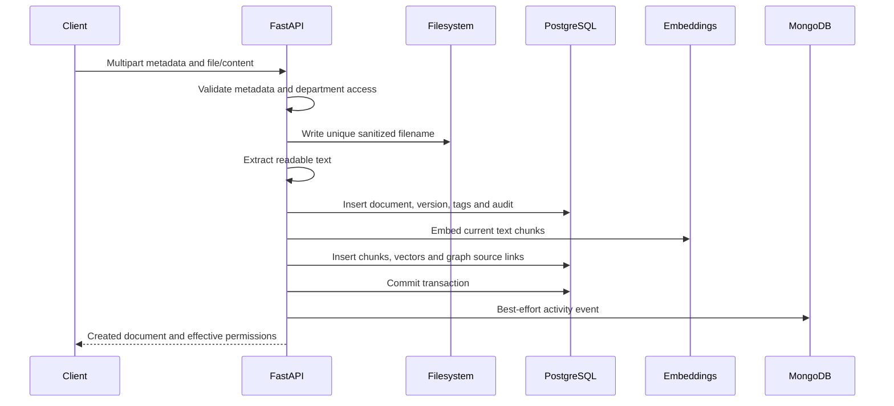
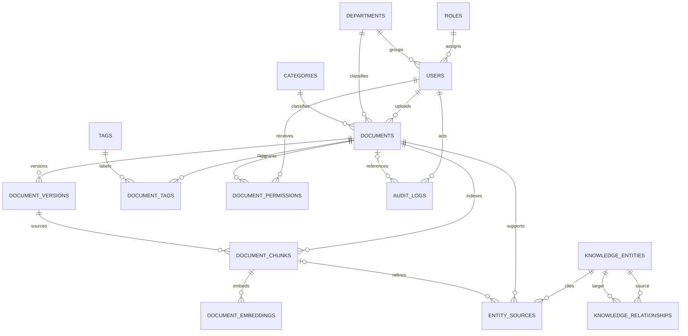

# KNOWLEDGESPHERE AI

## Engineering, Features, and Operations Manual

**Document number:** KS-ENG-OPS-001  
**Revision:** 1.0  
**Issue date:** 4 October 2026  
**Application baseline:** KnowledgeSphere AI 1.0.0, inspected local working copy  
**Repository:** https://github.com/sashank321/A7_DBMS_40_126_267  
**Document status:** Implementation reference; production release approval not established

---

### Document control

| Control | Definition |
| --- | --- |
| Purpose | Describe the installed application, its operating procedures, interfaces, data model, security boundaries, and verification baseline. |
| Intended readers | Product stakeholders, users, administrators, developers, reviewers, and support engineers. |
| Configuration authority | Running application configuration and current source code. |
| Contract authority | Live `/api/v1/openapi.json`, supplemented by route and service behavior documented here. |
| Maintenance owner | Repository maintainer; no formal approval authority is assigned by this document. |
| Revision basis | Source inspection and prior local integration verification; existing README marketing claims were not treated as evidence. |
| Distribution | Project documentation. Passwords, JWT secrets, provider keys, and private environment contents are excluded. |

### Revision record

| Revision | Date | Change description |
| --- | --- | --- |
| 1.0 | 2026-10-04 | Initial detailed engineering manual for the integrated Next.js/FastAPI application; live data, actual interfaces, operating procedures, verified fixes, and remaining limitations. |

### Conventions

- **CAUTION:** An action can alter or remove data, weaken a security boundary, or invalidate an installation.
- **NOTE:** Additional information needed to interpret the procedure or result.
- **Verified:** Observed in the local environment or exercised by the stated verification work.
- **Implemented:** Present in source; not necessarily tested in every deployment configuration.
- **Proposed:** A future change or release requirement, not a current feature.
- Example IDs, counts, hostnames, paths, and account labels are illustrative unless explicitly marked as an observed snapshot.

This manual uses an engineering document format. It does not imply endorsement by an aerospace manufacturer, industry certification, or suitability for safety-critical operation.

## Contents

1. [Purpose, scope, and product definition](#1-purpose-scope-and-product-definition)
2. [System baseline and verification status](#2-system-baseline-and-verification-status)
3. [Feature specifications](#3-feature-specifications)
4. [System architecture](#4-system-architecture)
5. [Identity and authorization](#5-identity-and-authorization)
6. [Document lifecycle](#6-document-lifecycle)
7. [Retrieval and answer generation](#7-retrieval-and-answer-generation)
8. [Knowledge graph](#8-knowledge-graph)
9. [Relational data design](#9-relational-data-design)
10. [MongoDB data design](#10-mongodb-data-design)
11. [API behavior and examples](#11-api-behavior-and-examples)
12. [Configuration reference](#12-configuration-reference)
13. [Installation and commissioning](#13-installation-and-commissioning)
14. [User operating procedures](#14-user-operating-procedures)
15. [Database administration](#15-database-administration)
16. [Operations and monitoring](#16-operations-and-monitoring)
17. [Backup, recovery, and data maintenance](#17-backup-recovery-and-data-maintenance)
18. [Troubleshooting](#18-troubleshooting)
19. [Verification and release acceptance](#19-verification-and-release-acceptance)
20. [Security and production readiness](#20-security-and-production-readiness)
21. [Maintenance and change control](#21-maintenance-and-change-control)
22. [Glossary and source register](#22-glossary-and-source-register)
23. [Appendix A: Endpoint reference](#appendix-a-api-endpoint-reference)
24. [Appendix B: Schema reference](#appendix-b-api-field-dictionary)
25. [Appendix C: Relational field reference](#appendix-c-relational-field-dictionary)

---

## 1. Purpose, scope, and product definition

### 1.1 Product purpose

KnowledgeSphere AI provides a common interface for managing organizational documents, finding relevant information, examining relationships between knowledge entities, and querying structured business records. Its distinguishing design is that document authorization is applied before document content becomes retrieval context.

The product combines document storage, metadata governance, numerical embeddings, a directed entity graph, relational analytics, and NoSQL feedback. These functions share a common identity and document model rather than operating as unrelated demonstrations.

### 1.2 Supported operating context

The verified installation is a local development/demonstration environment with a single PostgreSQL server, a single MongoDB server, one FastAPI process, a Next.js application, and local file storage. The data model describes one organization with departments and three roles. It does not provide isolated tenants or customer-specific database partitions.

The current source provides a Docker deployment definition and optional generative model providers. These configurations are documented as implemented options; they were not commissioned in the current verification environment.

### 1.3 Included scope

- Web sign-in, dashboard navigation, role demonstrations, and session synchronization.
- Document ingestion, extraction, tags, versions, downloads, permissions, and deletion.
- Semantic, structured, and hybrid retrieval.
- Structured question answering, document excerpts/citations, and graph relationship answers.
- PostgreSQL schema, SQL views, triggers, and numerical vector persistence.
- MongoDB event logging, reviews, and aggregation.
- Local startup, configuration, health checks, administration, and troubleshooting.
- API operations and declared request/response schemas.

### 1.4 Exclusions

OCR, scanned-document recognition, arbitrary natural-language SQL translation, scheduled ingestion, public registration, password recovery, SSO, MFA, document collaboration, email notifications, export approval workflows, legal holds, automatic retention enforcement, and distributed transactions are not implemented as complete product workflows. Historical files and placeholder-era AllocFlow routes must not be treated as supported modules.

## 2. System baseline and verification status

### 2.1 Observed local baseline

The following values were read from the running health endpoint during documentation preparation. They are a snapshot, not constants or installation requirements.

| Item | Observed value |
| --- | --- |
| Service | KnowledgeSphere AI |
| Reported application version | 1.0.0 |
| Overall health | OPERATIONAL |
| PostgreSQL | 18.4; `knowledgesphere_db`; HEALTHY |
| MongoDB | 8.3.8; `knowledgesphere_nosql`; HEALTHY |
| Local storage directory | Present; HEALTHY |
| Embedding provider | `sentence_transformers` |
| Embedding model | `all-MiniLM-L6-v2` |
| Actual embedding dimensions | 384 |
| Application relational tables | 15 |
| Current documents / embedding records | 10 / 10 |
| Departments | 5 |
| Knowledge entities / source links | 27 / 30 |
| Access-matrix rows | 80 |

The mounted API sub-application's OpenAPI `info.version` currently reports `0.1.0`; the health response reports application version `1.0.0`. This metadata difference is present in the implementation and should be corrected during release packaging.

### 2.2 Verification evidence

| Evidence | Result | Boundary |
| --- | --- | --- |
| Backend test suite | 78 passing tests | Isolated PostgreSQL/MongoDB fixture environment; particular sample IDs and baseline records are assumed. |
| Live integration checks | 24 passing checks | Local browser-facing proxy, backend, databases, and temporary test documents. |
| Frontend production build | Passed | Compilation, TypeScript validation, and static generation. Lint was skipped by configuration. |
| Browser UI checks | Verified selected workflows | Mobile dialog layout, validation feedback, cross-tab account changes, graph keyboard selection, authorized search, and hero cursor response. |
| Optional cloud/local generative providers | Not verified end to end | Implemented connectors do not establish provider availability or model answer quality. |
| Docker Compose | Not executed in this environment | Configuration inspection only. |
| Load, penetration, disaster-recovery tests | Not established | No operational SLA, certification, or throughput benchmark is claimed. |

Tests passed against the local working tree before documentation creation. No commit, remote synchronization, or release tag is implied by these results.

## 3. Feature specifications

### 3.1 Feature register

| ID | Feature | Operator-visible result | Important constraint |
| --- | --- | --- | --- |
| KS-F-001 | Authentication | Valid credentials create a signed access token and user session. | No refresh-token or server-side logout revocation workflow. |
| KS-F-002 | Document catalog | Only viewable documents are listed with live department/category labels and action flags. | Lists are not paginated. |
| KS-F-003 | Ingestion | Uploaded file or pasted text becomes a document, version, searchable chunks, vectors, and graph links. | Processing is synchronous. Readable text is required. |
| KS-F-004 | Versioning | A new sequential version becomes the current downloadable and indexed content. | Older versions are retained as metadata/files but are not independently searchable through the UI. |
| KS-F-005 | Explicit grants | Owner/Admin loads real users and saved view/edit/delete settings. | Grants cannot remove Admin, ownership, or department Manager baseline access. |
| KS-F-006 | Semantic retrieval | Authorized chunks receive cosine similarity scores and provenance. | Linear in-process scoring; no ANN index. |
| KS-F-007 | Hybrid retrieval | Semantic and metadata results are fused into document-ranked matches. | Fusion score is not a cosine score or calibrated probability. |
| KS-F-008 | RAG Copilot | Structured records, relationship statements, or cited document evidence answer a question. | SQL and graph branches may return no document citation objects. |
| KS-F-009 | SQL analytics | Supported patterns produce validated read-only SQL and tabular results. | Translation is a rule/template system, not a general SQL-generating model. |
| KS-F-010 | Knowledge graph | Typed nodes and directed connections can be inspected and filtered. | Relationship visibility is derived from visible endpoint entities. |
| KS-F-011 | Reviews | A readable comment and 1-5 rating are inserted into MongoDB for an accessible document. | No review edit/delete workflow; no per-user uniqueness rule. |
| KS-F-012 | Telemetry | Aggregations show real activity counts, review totals, ratings, and action distributions. | Event logging is best effort; not a durable message queue. |
| KS-F-013 | Audit views | Authorized administrative users inspect relational audit information and effective access. | The SQL matrix is an analytical view, not the runtime authorization implementation. |
| KS-F-014 | Platform metadata | Database versions, active model dimensions, choices, and counts load from APIs. | Public health data exposes system inventory. |
| KS-F-015 | Responsive dashboard | Navigation and tables remain usable on narrow screens; dialogs scroll within the viewport. | Selected browser checks do not replace a full accessibility audit. |
| KS-F-016 | Interactive landing hero | Computer tilt follows the pointer with eased motion; resting alignment is preserved. | Reduced-motion preference disables rotation. |

### 3.2 UI route register

| Route | Function | Navigation audience |
| --- | --- | --- |
| `/` | Product landing page, live illustration metrics, repository links. | Public |
| `/login` | Credential sign-in and optional configured demo accounts. | Public |
| `/dashboard` | System overview, document distribution, polyglot storage breakdown, and recent audit activity. | Authenticated |
| `/dashboard/documents` | Document catalog, ingestion, version upload, downloads, grants, deletion. | Authenticated; controls follow per-document permissions. |
| `/dashboard/search` | Query, department selection, result limit, suggested accessible document titles. | Authenticated |
| `/dashboard/rag` | Question answering with source evidence and route/provider information. | Authenticated |
| `/dashboard/text2sql` | Validated relational analytics terminal. | Authenticated |
| `/dashboard/graph-view` | Connected graph, entity filters, inspector, search, zoom and neighbors. | Authenticated |
| `/dashboard/telemetry` | Activity/review summaries and document review submission. | Authenticated |
| `/dashboard/audit` | Audit analytics and access matrix. | Admin in the current navigation. |

Some API capabilities are available to Manager even when the sidebar does not expose an equivalent administrative page. UI absence is not an authorization rule.

## 4. System architecture

### 4.1 Component arrangement



### 4.2 Request boundary

Browser API calls normally target `/api/v1` on the Next.js origin. The Next.js catch-all route forwards the method, query string, authorization header, and binary request body to the configured internal backend address. It also forwards downloads and multipart uploads rather than fabricating application responses.

The proxy strips transport headers that should not be forwarded, uses uncached backend requests, and has a 120-second request timeout. It buffers request and response bodies. This behavior simplifies the prototype but increases memory pressure for large uploads/downloads. A network failure returns HTTP 503 with a backend-unavailable message.

### 4.3 Persistence boundaries

PostgreSQL is authoritative for users, taxonomy, documents, versions, permissions, chunks, embeddings, graph entities, and relational audit logs. The filesystem stores uploaded document bytes. MongoDB stores activity records and reviews. pgAdmin is an administration client connected to PostgreSQL; the application does not store data in pgAdmin itself.

The application does not implement a distributed commit spanning PostgreSQL, MongoDB, and the filesystem. Document creation/version routines use a SQL transaction and track newly written files for compensation on failure. MongoDB activity logging occurs separately and may fail without rejecting the main operation.

### 4.4 Technology responsibilities

| Technology | Responsibility |
| --- | --- |
| Next.js 14.2.5 / React | Routing, rendering, forms, dashboard and same-origin proxy. |
| TanStack Query | Query caching, mutation state and invalidation. |
| Axios | Browser HTTP calls and bearer-token handling. |
| FastAPI / Pydantic | HTTP routes, request validation and generated contracts. |
| SQLAlchemy / psycopg2 | ORM/session handling and PostgreSQL connectivity. |
| PyMongo | MongoDB inserts, reads, indexes and aggregations. |
| SentenceTransformers / NumPy | Neural embeddings and numerical similarity. |
| sqlglot | SQL AST parsing and rewriting. |
| pypdf / python-docx | Readable PDF and Word text extraction. |
| bcrypt / python-jose | Password hashing and JWT signing/verification. |
| Recharts / SVG | Statistical charts and interactive graph depiction. |

Python dependencies mostly use minimum-version ranges. Only selected dependencies are tightly constrained. Reproducible production releases require a resolved dependency lock and software inventory.

## 5. Identity and authorization

### 5.1 Authentication sequence

1. A client submits an email/password pair to JSON login, or submits an email as the OAuth2 form `username`.
2. The backend locates the stored user and verifies the bcrypt hash.
3. On success, a JWT is signed with `JWT_SECRET` and the configured algorithm.
4. The response contains the token and profile identity fields.
5. The browser stores the token locally and sends `Authorization: Bearer <token>` on subsequent API requests.
6. Backend dependencies decode the JWT and load the current user from PostgreSQL. Authorization uses the user's current database role and department.

The default access-token lifetime is 1,440 minutes. Stored claims include subject, user ID, role, department ID, and expiry. Removing a user prevents subsequent authenticated requests; changing a role is reflected in the database-backed user lookup.

### 5.2 Document rule precedence

Runtime authorization is implemented by `DocumentService.check_user_access`, in this order:

| Priority | Condition | View | Edit | Delete |
| --- | --- | --- | --- | --- |
| 1 | User is Admin | Yes | Yes | Yes |
| 2 | User uploaded the document | Yes | Yes | Yes |
| 3 | User is Manager in the document's department | Yes | Yes | No |
| 4 | An explicit permission row exists | Stored `can_view` | Stored `can_edit` | Stored `can_delete` |
| 5 | No condition matched | No | No | No |

**NOTE:** Explicit settings are evaluated only after the earlier rules fail. Therefore they are grants for otherwise unprivileged access, not universal deny rules. A same-department Manager's explicit delete grant is currently ignored by the runtime Manager branch; the SQL access matrix can nevertheless show deletion allowed. Treat this discrepancy as a release gap and verify runtime behavior before administering such grants.

The API allows independent booleans. An edit grant does not automatically imply view access. Such combinations can be difficult to operate because the catalog includes only viewable documents. Administrators should grant view together with edit/delete unless an approved workflow intentionally requires otherwise.

### 5.3 Administrative authorization

| Operation | Accepted audience |
| --- | --- |
| Create user | Admin |
| List users | Admin or Manager |
| Read a user by ID | Any authenticated user in the current API. |
| Create graph entity/relationship | Admin or Manager |
| Read audit log list | Admin or Manager; current list is not department-scoped. |
| Audit analytics / full access matrix | Admin |
| Manage document grants | Admin or original uploader |
| Read/post document reviews | User who can view the target document. |

### 5.4 Browser session behavior

The browser verifies a saved session using `/auth/me`. Logout clears locally stored session keys and the query cache. Token changes in another tab clear cached data and reload the profile, preventing the old tab from retaining the prior account's graph or document results. Unauthorized responses clear the active session only if they correspond to its current token; login failures are handled separately.

JWT storage is currently browser local storage. It is not protected by HttpOnly cookies, and logout does not revoke already issued tokens on the server. These are material production design considerations.

## 6. Document lifecycle

### 6.1 Ingestion requirements

The primary advertised formats are `.txt`, `.md`, `.pdf`, and `.docx`. The implementation also treats `.json`, `.csv`, `.sql`, and `.py` as readable UTF-8 text. The generic extraction branch attempts to read other formats as text; there is no comprehensive MIME/type allowlist or malware scanning layer.

Document titles must contain 1-200 characters after trimming. Departments and categories must exist. Non-Admin users must upload to their own department. At least a file or nonempty content is required. Tags are trimmed, deduplicated, and limited to 50 characters per tag.

PDF processing extracts text that is available to pypdf. Image-only PDFs have no readable text and are rejected unless text has already been provided by an external OCR process. Word extraction includes paragraphs, tables, merged-cell deduplication, and nested tables. General layout fidelity, headers, footers, and embedded images are not reproduced in the index.

### 6.2 Create transaction



UUID-based storage filenames reduce collisions. Original names are sanitized for Windows-invalid characters and path separators. A failed transaction rolls back SQL changes and attempts to remove new files. Failure compensation is not a substitute for a filesystem integrity scan after an operating-system crash.

### 6.3 Version update

An editor may upload a new file or text body. The service locks the document row, calculates the next version number, writes the new physical file, inserts version/audit rows, updates the document's current file, and reindexes its content. Database uniqueness prevents duplicate `(document_id, version_number)` pairs.

Only current chunks are retained in the retrieval index: reindexing deletes the old document chunks and associated embeddings. Historical version rows and files remain, but there is no version-specific download route or history browsing workflow in the current API/UI.

### 6.4 Download and deletion

Download checks view permission and checks the resolved path lies under the configured storage directory. It returns the current physical file with a download filename. Missing records/files return 404; forbidden access or an out-of-storage path returns 403.

Deletion checks delete permission, removes the SQL document and dependent records, removes a document graph entity where it is solely sourced from that document, and then attempts to delete in-storage current/history files. This SQL commit precedes physical file removal. A filesystem removal failure can therefore leave orphan files or a failed-looking response after the database deletion has succeeded.

MongoDB review records are not cascade-deleted by SQL. Current telemetry filters reviews to documents that still exist and are accessible. A separate approved retention procedure is required to purge historical orphan reviews if desired.

## 7. Retrieval and answer generation

### 7.1 Chunking

The chunking service uses a word window of 120 words and overlap of 25 words, with a nominal step of 95 words. It flattens nonempty paragraphs into whitespace-separated words and creates numbered chunks. `token_count` is a word count in this implementation, not an LLM tokenizer count. Long-document handling must therefore not be described as precise model-token budgeting.

Every chunk links to a document and the indexed version. Each vector record contains the chunk ID, provider identifier, dimensions, and floating-point array. Current chunks are reindexed when a version changes.

### 7.2 Embeddings

| Provider | Behavior | Status |
| --- | --- | --- |
| SentenceTransformers | Configured neural model; normalized vectors rounded for storage. Default MiniLM produces 384 dimensions. | Verified locally. |
| Deterministic / CRC32 | Token and bigram hashing into a normalized 128-dimensional default vector. | Development/test option; not neural semantic understanding. |
| OpenAI | Sends text to the configured embedding model through the implemented HTTP connector. | Optional; not verified in the current environment. |

The real local model is loaded during startup. Failure to load it stops successful startup rather than silently substituting hashing. Initial model acquisition may contact the model hub; offline operation requires an already usable cache.

Provider/model changes require a process restart and reindexing. Mismatched vector lengths score zero in the similarity utility. The OpenAI connector currently does not transmit a requested `dimensions` parameter, although configuration exposes `OPENAI_EMBEDDING_DIM`; changing that setting alone does not guarantee changed vector output. Validate actual vectors before adopting a new provider configuration.

### 7.3 Search channels

Semantic search determines the user's viewable documents, applies explicit department/category filters, retrieves their indexed chunks, embeds the query, and computes cosine similarity in Python. Matches below `SIMILARITY_THRESHOLD` are removed, then the best results are returned.

Structured search matches query terms longer than two characters against title, description, and tag strings. Its heuristic weights are 0.5 for title, 0.3 for description, and 0.4 for tags, with its displayed score capped at 1.0. It is not full PostgreSQL text search. It carries the indexed chunk's actual version into provenance for citations.

Hybrid search combines both channels using reciprocal rank fusion:

```text
RRF(document) = sum over retrieval channels of 1 / (60 + channel_rank)
Displayed fusion score = RRF(document) * 60
```

Each document contributes once per channel; the best semantic chunk represents that document. Because two channels may contribute, the displayed fusion score can exceed 1.0. The UI labels cosine, text-match, and fusion scores separately.

### 7.4 Intent routing

Routing is deterministic and ordered: structured patterns first, graph patterns second, a department-plus-conceptual pattern for hybrid, semantic explanation patterns, then hybrid fallback. Department recognition uses a predefined vocabulary in the router; adding a catalog department does not automatically update this vocabulary.

The `/search` endpoint uses vector search for SEMANTIC, metadata search for STRUCTURED, and hybrid search for GRAPH or HYBRID. A GRAPH search label therefore does not mean that this endpoint performed graph traversal. Graph traversal is exposed by graph routes and the RAG graph branch.

### 7.5 RAG execution

1. Classify the question and calculate accessible documents.
2. For a structured intent, attempt scoped SQL; a successful result returns formatted records.
3. For a graph intent, search meaningful question terms for entity connections; matches return relationship statements.
4. Otherwise retrieve authorized documents using hybrid search.
5. If no sufficiently relevant context is available, return an insufficient-information answer.
6. Attach document/version/chunk citation objects to retrieved document evidence.
7. Pass up to three retrieved items to the selected synthesis provider.

The citation list may include more retrieved items than the three used by the provider. SQL and graph branches can have empty citation lists. Confidence values are fixed/heuristic route and retrieval indicators, not statistical estimates of truth.

### 7.6 Answer providers

- **Extractive:** returns source passages with document and chunk labels. It is useful when no generative model is available.
- **Local generative:** probes an OpenAI-compatible `/models` endpoint and sends chat-completion requests. If unavailable or unsuccessful, it falls back to extractive output with a note.
- **OpenAI generative:** sends authorized context to the configured connector's chat endpoint. Provider errors do not have the same automatic fallback behavior as the local connector.
- **Auto:** selects OpenAI when a key is configured; otherwise uses the local-provider path and its extractive fallback.

The OpenAI answer model is a constructor default in source, not a general environment-selectable model field. `ANTHROPIC_API_KEY` exists in settings but no active Anthropic provider implementation is present.

**CAUTION:** Citations support traceability. They do not prove that a document is factually correct, current, applicable, or an appropriate source. Neither extractive nor generative answers carry a zero-hallucination or 100-percent-accuracy guarantee.

### 7.7 SQL controls

Natural-language translation recognizes a limited set of templates, including department counts, user/role lists, category counts, audit activity, document versions, and an Engineering-document pattern. Unrecognized questions fall back to a document-overview query; users must inspect generated SQL rather than assume their intent was understood.

SQL-looking input is parsed using sqlglot. Only one `SELECT` AST is accepted; mutations, `SELECT INTO`, locks, unauthorized schemas/tables, credential columns, unsafe user wildcards, and unapproved functions are rejected. Allowed functions include COUNT, SUM, AVG, MIN, MAX, COALESCE, LOWER, UPPER, LENGTH, and ROUND. Some valid SQL such as certain CTE/union forms falls outside the permitted shape.

Queries are rewritten to scoped subqueries before execution. Document-related tables are limited to accessible document IDs for non-Admin users. Employee user queries are limited to the current user's record. Non-Admin audit/access-matrix queries are restricted by user and accessible document IDs. Execution uses a read-only transaction and a 3,000-millisecond statement timeout.

Results are fully fetched; there is no universal maximum row count. The public `generated_sql` value represents the input/generated statement, not necessarily the rewritten executed statement. Detailed execution errors may disclose database diagnostics. These are release considerations.

## 8. Knowledge graph

### 8.1 Data and creation

The graph is stored in PostgreSQL, not Neo4j. Entities have a name, type, description, and metadata. Directed relationships connect source and target IDs and carry a type and weight. Source records connect an entity to a document and optionally a chunk.

Ordinary ingestion creates a DOCUMENT entity labeled with the title and document ID, a PERSON entity for the uploader, a DEPARTMENT entity, provenance links, an `OWNS` edge, and a `BELONGS_TO` edge. General-purpose automated entity extraction from every sentence is not implemented. Additional graph content comes from seeds or authorized API creation.

### 8.2 Visibility

Admin can read the full graph up to the requested node limit. Other users see entities with provenance in at least one viewable document. An edge appears when both endpoint IDs are visible in the returned node set. An entity created without a document source may therefore be invisible to non-Admin users.

There is no source-document permission attached to each edge. Shared entity descriptions/relationships can be visible because endpoints are sourced from some accessible document even if a relationship originated in different context. Production confidentiality requires a more complete edge/attribute provenance and authorization design.

### 8.3 Operator controls

The graph page supports type filters, textual entity-list search, selected-entity neighbor filtering, zoom, reset, refresh, node selection, and an incoming/outgoing connection inspector. The canvas may scroll while the rest of the page fits the viewport. Keyboard users can focus and activate nodes or list items.

The full graph route accepts 1-500 nodes; default is 50. The dashboard requests up to 500. Counts describe returned nodes/edges, not necessarily all graph records beyond the limit. Connection lookup uses partial name matching and chooses the first matching entity; ambiguous names require explicit inspection.

## 9. Relational data design

### 9.1 Table responsibilities

| Table | Responsibility | Principal relationship/constraint |
| --- | --- | --- |
| `roles` | Named access roles. | Unique role name. |
| `departments` | Organizational units. | Unique department name. |
| `users` | Identity, bcrypt password hash, role and department. | Unique email; role/department foreign keys. |
| `categories` | Document taxonomy. | Unique category name. |
| `documents` | Metadata and current file pointer. | Uploader, department and category foreign keys. |
| `tags` | Reusable labels. | Unique tag name. |
| `document_tags` | Document/tag association. | Composite primary key. |
| `document_versions` | Historical file pointers and uploader. | Unique document/version pair; positive version check. |
| `audit_logs` | Relational action history. | Deleted document references become null. |
| `document_permissions` | Explicit view/edit/delete flags. | Unique document/user pair. |
| `document_chunks` | Current indexed passages. | Unique document/chunk number; document/version links. |
| `document_embeddings` | Numerical vector arrays and provider metadata. | Chunk foreign key; unique chunk/model pair. |
| `knowledge_entities` | Graph vertices. | Unique name/type pair. |
| `knowledge_relationships` | Directed graph edges. | Unique source/target/relation triple. |
| `entity_sources` | Entity provenance. | Entity/document/chunk links. |

Separating roles, departments, categories, tags, and associations avoids repeating their descriptive values in ordinary relational records. This reflects normalization goals. Array vectors and JSON metadata are deliberately used for numerical and flexible extension data.

### 9.2 Relationship overview



### 9.3 Views and triggers

- `v_document_overview` joins document metadata with identity/taxonomy and aggregates latest version and tag counts.
- `v_user_access_matrix` produces the cross product of users/documents and calculates analytical permission flags.
- `v_audit_analytics` uses `LAG` for previous action/time and `ROW_NUMBER` for recency rank.
- A document-update trigger refreshes `updated_at`.
- A version-insert trigger writes a relational audit record. Application logic also writes its own upload/version audit records, so multiple audit entries may represent one operation.

The 80-row observed access matrix reflects 8 sample users multiplied by 10 documents; it is not a constant. Timestamp columns are largely PostgreSQL `TIMESTAMP` without timezone, while MongoDB events use UTC-aware values. Applications comparing them need an explicit timezone convention.

### 9.4 Integrity and scale limits

Foreign keys and cascades protect ordinary relational dependencies. Deleting a user can cascade uploaded documents; direct administrative deletion requires attention to that consequence. `entity_sources` uniqueness includes a nullable chunk ID; PostgreSQL's ordinary null semantics do not guarantee uniqueness for repeated null-chunk links. The service checks existing links, but concurrency requires further enforcement.

There is no database check that vector array length equals the declared dimensions, no full-text/ANN retrieval index in the active search path, and no versioned migration framework. Application metadata/path fields are returned through the API and should not be assumed confidential from authenticated recipients.

## 10. MongoDB data design

### 10.1 Activity collection

`activity_logs` records `action_type`, `user_id`, optional `document_id`, a variable `details` object, and UTC `timestamp`. Observed operation types include document listing/view/upload/version/deletion, search, and RAG queries. Details can include query text, routing intent, result counts, confidence, and citation counts.

Indexes cover `(user_id, timestamp)`, action type, and document ID. Event insertion is best effort: the logging method catches failures and returns an empty string. There is no durable retry, outbox, queue, or guaranteed delivery mechanism. Activity totals should not be used as a compliance-complete count of all operations.

### 10.2 Reviews collection

`document_reviews` contains document/user identifiers, display name, rating, trimmed feedback, and UTC creation time. Ratings are validated to 1-5 and comments to 1-10,000 nonblank characters. API access is checked in PostgreSQL before review read/write.

Indexes cover `(document_id, rating)` and user ID. There is no MongoDB foreign key to PostgreSQL, no one-review-per-user constraint, and no public review edit/delete endpoint.

### 10.3 Aggregation scope

Admin activity summaries include all events; other users' activity summaries include their own events. Reviews are limited to existing documents accessible to the requesting user, including for Admin. `$group`, `$avg`, `$sort`, and `$limit` produce distribution and document summaries. Recent activities are limited to 20 and top-reviewed summaries to 10.

Collections may persist historical events and reviews after SQL deletion. Access filtering governs returned current statistics; it does not physically purge those MongoDB records.

## 11. API behavior and examples

### 11.1 Addresses and contract

The API prefix is `/api/v1`. Browser-facing requests use `http://localhost:3000/api/v1`; local backend requests use `http://localhost:8000/api/v1`. Swagger is at `/api/v1/docs` and the machine-readable contract at `/api/v1/openapi.json` on the backend.

Most operations require bearer authentication. Health, demo discovery, and login are public. Route-level roles and object ownership are stronger conditions than the general OpenAPI security declaration; Appendix A records those conditions.

### 11.2 Common HTTP results

| Result | Interpretation |
| --- | --- |
| 200 | Read or mutation completed; inspect the application status for SQL outcomes. |
| 201 | Document, user, or review created where explicitly declared. |
| 401 | Missing/invalid credentials or token. |
| 403 | Authenticated user lacks the required role/object access. |
| 404 | Target object or physical download is unavailable. |
| 422 | Input validation or extraction rejected the operation. |
| 503 | The frontend proxy cannot reach/complete the backend request. |
| 500 | Unhandled processing/provider/database error; investigate backend diagnostics. |

FastAPI validation details may be an array of error objects rather than a single string. Clients must render messages safely. SQL rejection is commonly an HTTP 200 response with application `status: REJECTED`; execution failure can be `EXECUTION_ERROR`. A health response may be HTTP 200 while overall `status` is `DEGRADED`.

### 11.3 Credential sign-in

Illustrative request; replace all placeholders with actual values:

```http
POST /api/v1/auth/login-json
Content-Type: application/json

{"email":"user@example.com","password":"<account-password>"}
```

Store the returned `access_token` securely and send it as a bearer token. Profile fields in the response identify the logged-in role and department. Do not log the full response because it contains a credential.

### 11.4 Search and document questions

```http
POST /api/v1/search
Authorization: Bearer <access-token>
Content-Type: application/json

{"query":"remote work policy","top_k":5}
```

```http
POST /api/v1/rag/query
Authorization: Bearer <access-token>
Content-Type: application/json

{"question":"Summarize the remote work policy","top_k":4}
```

Search results contain document/chunk identity, content snippets, scores, retrieval mode, and provenance. RAG results include the route, answer, confidence, citation list, filtered-document count, and optional synthesis provider information. `top_k` must be an integer from 1-100; query/question input is trimmed and limited to 4,000 characters.

### 11.5 Multipart creation

```http
POST /api/v1/documents
Authorization: Bearer <access-token>
Content-Type: multipart/form-data; boundary=<client-generated>

title=<document title>
description=<optional description>
department_id=<existing permitted department ID>
category_id=<existing category ID>
tags=Operations,Approved
file=<binary upload>
```

Use the client's multipart implementation to generate the boundary. Use `content` instead of `file` for pasted text. Department/category IDs should come from `/catalog`, not a client-maintained name-to-number mapping. The version route accepts file/content but does not replace all metadata.

### 11.6 Permissions and reviews

```http
PUT /api/v1/documents/<document-id>/permissions
Authorization: Bearer <owner-or-admin-token>
Content-Type: application/json

{"user_id":123,"can_view":true,"can_edit":false,"can_delete":false}
```

The target ID above is illustrative. Retrieve valid targets and saved grants from the document's permission editor endpoint. For reviews, submit document ID, rating, and `review_text` to `/nosql/reviews`; do not post against a document the user cannot view.

## 12. Configuration reference

### 12.1 Backend settings

The private repository-root `.env` is read by the settings class. Process environment values may override configuration. Restart the backend after changing its settings.

| Variable | Default/reference | Purpose and notes |
| --- | --- | --- |
| `PROJECT_NAME` | KnowledgeSphere AI | Service display name. |
| `PROJECT_VERSION` | 1.0.0 | Application health/version label. |
| `API_V1_STR` | `/api/v1` | Backend mount path; changing it also requires client/proxy changes. |
| `POSTGRES_HOST` | localhost | PostgreSQL host. |
| `POSTGRES_PORT` | 5432 | PostgreSQL port. |
| `POSTGRES_USER` | postgres | Login role; use a restricted application role for deployment. |
| `POSTGRES_PASSWORD` | Empty unless configured | Private database credential. |
| `POSTGRES_DB` | knowledgesphere_db | Application database. |
| `MONGO_URI` | mongodb://localhost:27017/ | Connection string; protect embedded credentials if used. |
| `MONGO_DB` | knowledgesphere_nosql | Application MongoDB database. |
| `JWT_SECRET` | Required; at least 32 characters | Signing secret; use a generated random value. |
| `JWT_ALGORITHM` | HS256 | Signature algorithm. |
| `ACCESS_TOKEN_EXPIRE_MINUTES` | 1440 | Token lifetime. |
| `STORAGE_DIR` | storage/documents | Relative paths resolve against the repository root. |
| `EMBEDDING_PROVIDER` | sentence_transformers | Active vector provider. |
| `EMBEDDING_MODEL` | all-MiniLM-L6-v2 | Local model identifier. |
| `EMBEDDING_DIM` | 384 | Legacy/general configuration value; actual local dimensions are derived from the model. |
| `DETERMINISTIC_EMBEDDING_DIM` | 128 | Development hashing dimension. |
| `OPENAI_EMBEDDING_MODEL` | text-embedding-3-small | Optional connector model. |
| `OPENAI_EMBEDDING_DIM` | 1536 | Reported connector dimension; see Section 7.2 caveat. |
| `SIMILARITY_THRESHOLD` | 0.15 | Semantic match cutoff. |
| `RAG_PROVIDER` | auto | Answer-provider selection. |
| `LOCAL_LLM_URL` | http://localhost:11434/v1 | Optional local generative server. |
| `LOCAL_LLM_MODEL` | llama3 | Optional local generative model. |
| `OPENAI_API_KEY` | Empty | Optional external provider secret. |
| `ANTHROPIC_API_KEY` | Empty | Present in settings, without an active implemented provider. |
| `DEMO_ACCOUNT_EMAILS` | `[]` | JSON list of deliberately published demo identities. |

### 12.2 Frontend and administration settings

| Variable | Reference | Treatment |
| --- | --- | --- |
| `BACKEND_INTERNAL_URL` | http://127.0.0.1:8000 | Server-side proxy destination; use the backend service name in containers. |
| `NEXT_PUBLIC_API_URL` | `/api/v1` | Browser API base; compiled into the frontend. |
| `NEXT_PUBLIC_DEMO_PASSWORD` | Empty | Public demo-only password. Never place a real production credential here. |
| `NEXT_PUBLIC_LOGIN_VIDEO_URL` | Empty | Optional public background media address. |
| `PGADMIN_DEFAULT_EMAIL` | Compose configuration | Administration UI login identity, separate from application users. |
| `PGADMIN_DEFAULT_PASSWORD` | Must be set deliberately | Administration UI credential; Compose contains an insecure fallback if omitted. |

Public frontend values require rebuilding to change the shipped browser bundle. Enabling demo buttons requires both a configured demo list and a usable public demo password. Account discovery returns identities, not their password hashes.

## 13. Installation and commissioning

### PROC-13-01: Prepare a local installation

**Prerequisites:** repository access; compatible Python/Node installations; running PostgreSQL and MongoDB; permission to create an empty demonstration database; adequate model-cache and storage space.

1. Clone the repository and enter its root.
2. Create `.venv` with Python 3.12 for the verified reference environment.
3. Install `requirements.txt` using that virtual environment's interpreter.
4. Copy `.env.example` to `.env`; configure actual database addresses/credentials and a random JWT secret.
5. Confirm PostgreSQL/MongoDB are reachable independently.
6. For a new demo database only, execute `scripts/init_db.py`, then `scripts/seed_ai_and_graph.py`.
7. Start the backend using `app.main:app` from the repository root.
8. In `frontend`, copy `.env.example` to `.env.local`, configure the internal backend address, run `npm ci`, build, and start.
9. Open health and confirm `OPERATIONAL`; sign in with an existing valid account.

```powershell
git clone https://github.com/sashank321/A7_DBMS_40_126_267.git
Set-Location A7_DBMS_40_126_267
py -3.12 -m venv .venv
.\.venv\Scripts\python.exe -m pip install -r requirements.txt
Copy-Item .env.example .env
# Edit .env before continuing.
.\.venv\Scripts\python.exe scripts/init_db.py
.\.venv\Scripts\python.exe scripts/seed_ai_and_graph.py
.\.venv\Scripts\python.exe -m uvicorn app.main:app --host 127.0.0.1 --port 8000
```

In a separate terminal rooted at the repository:

```powershell
Set-Location frontend
Copy-Item .env.example .env.local
# Edit .env.local if needed.
npm ci
npm run build
npm start
```

**Expected result:** Next.js listens on 3000, FastAPI on 8000, both stores are healthy, and accessible documents appear after sign-in.

**CAUTION:** The SQL schema file itself drops tables. The wrapper protects an existing schema by skipping initialization, but it is not a migration tool. Never run raw schema files against an operational database without an approved rebuild plan and verified backups.

### PROC-13-02: Development startup

Use Uvicorn `--reload` and `npm run dev` for development. Do not run development and production frontend processes on port 3000 simultaneously. Stop only the processes belonging to this installation before changing modes.

The backend model preloads during startup. A cache/library issue can prevent the API from becoming ready. MongoDB index initialization can log a warning and continue, so a listening backend port alone does not establish full platform health.

### PROC-13-03: Container configuration review

Compose defines PostgreSQL, pgAdmin, MongoDB, backend and frontend services. PostgreSQL uses the `pgvector/pgvector:pg16` image, MongoDB uses `mongo:7.0`, pgAdmin exposes 5050, and the frontend/backend expose 3000/8000. Named volumes persist databases and pgAdmin state; a bind mount persists document storage.

Configure required secrets before `docker compose up --build -d`. This command is an available deployment path, not a verified result here. Exposed database ports, unauthenticated MongoDB defaults, pgAdmin's fallback password, health-check environment interpolation, and container build inputs require deployment review. The frontend image copies runtime/public build artifacts but the homepage reads a source HTML file at runtime; the image must include that file or the page implementation must change before approving container deployment.

## 14. User operating procedures

### PROC-14-01: Sign in and establish scope

1. Open `/login` and enter existing credentials, or choose a deliberately configured demo account.
2. Confirm the displayed name and role before handling documents.
3. Check the backend indicator and document list.
4. Sign out when finished, especially on a shared workstation.

**Expected result:** the dashboard loads the current profile and clears any previous account's cached data. Demo switching is for demonstration accounts, not a production impersonation function.

### PROC-14-02: Ingest a document

1. Open Document Explorer and select **Ingest Document**.
2. Enter a meaningful title and optional description.
3. Select a department and category from the live catalog. Non-Admin department selection follows the profile's department.
4. Enter optional comma-separated tags.
5. Select a readable file or paste text.
6. Submit once and wait for indexing completion.
7. Confirm the document appears, downloads correctly, and can be retrieved.

**Rejected input:** the dialog remains open and displays an error. Correct the indicated field and retry. Keep the source file until the round-trip download has been confirmed.

### PROC-14-03: Upload a new version

1. Locate an editable document and select **Add Version**.
2. Choose a replacement file or enter revised text.
3. Save and wait for completion.
4. Confirm the version label increased and the download/search citation reflects current content.

The title/category/tag metadata is not revised by this form. A failed indexing transaction should retain the previous current file/index. Preserve your replacement source to retry after the error is resolved.

### PROC-14-04: Grant access

1. As Admin or uploader, open **Manage Permissions**.
2. Choose an actual target user from the loaded list.
3. Review saved flags and role/ownership baseline access.
4. Set the required explicit grants and save.
5. Verify access with the intended role/account using a separate permitted session.

Use the runtime access rules in Section 5; do not interpret unchecked boxes as denying an owner's or Admin's rights. Avoid granting delete casually. No approval workflow is enforced by the application.

### PROC-14-05: Search and ask questions

1. Select Search or RAG Copilot.
2. Enter a specific query/question; optionally select search department and result limit.
3. Execute and inspect route, score type, returned document identity, version, and source excerpts.
4. Open/download the source where validation is important.
5. Treat insufficient-information output as a retrieval limitation rather than proof that information does not exist anywhere.

Suggested questions are derived from accessible document titles. Changing a department filter does not grant access to that department's private documents.

### PROC-14-06: Inspect a graph

Select an entity, read its full description and incoming/outgoing relationships, enable neighbor-only mode if useful, and use the list search/type filter to narrow the view. Arrow direction distinguishes source from target. Reset zoom or refresh when the layout is difficult to read. No matching entities can be a permission/provenance condition rather than a server failure.

### PROC-14-07: Submit a review

Choose a viewable document in Telemetry, select a 1-5 rating, enter substantive feedback, and submit. Confirm success and updated aggregate statistics. Multiple submissions are separate records; avoid repeating a submission merely because aggregate counts have not yet refreshed.

### PROC-14-08: Delete a document

Confirm the target identity and obtain any required organizational approval outside the application. Select Delete and confirm the dialog. Deletion removes current/history document records and authorized files. There is no restore button or recycle-bin workflow. If an error appears, inspect whether the database record is already gone before retrying.

## 15. Database administration

### 15.1 PostgreSQL through pgAdmin

Register a server in pgAdmin using the same host, port, database and login role configured for the backend. The pgAdmin account that signs into the administration UI is different from the PostgreSQL login role. A desktop installation typically uses `localhost:5432`; container pgAdmin uses the Compose service hostname `postgres` to reach its peer container.

Expand the actual application database, then **Schemas > public > Tables/Views**. Confirm the 15 application tables and three analytical views. Use read-only inspection for routine diagnosis:

```sql
SELECT current_database(), version();
SELECT COUNT(*) AS documents FROM documents;
SELECT model_name, dimensions, COUNT(*)
FROM document_embeddings GROUP BY model_name, dimensions;
SELECT COUNT(*) AS access_pairs FROM v_user_access_matrix;
```

**CAUTION:** Do not export password hashes into documentation or screenshots. Manual database edits bypass service-level access validation, indexing, graph updates, and filesystem coordination.

### 15.2 MongoDB inspection

Connect an approved MongoDB client to the configured `MONGO_URI`; select `MONGO_DB`. Inspect `activity_logs` and `document_reviews`, their indexes, and timestamps. Local development may run without authentication; a deployment must explicitly address authentication, network exposure, and backups.

```javascript
db.activity_logs.countDocuments({})
db.document_reviews.aggregate([
  {$group: {_id: "$document_id", reviews: {$sum: 1}, average: {$avg: "$rating"}}}
])
```

Raw admin queries can include reviews of deleted documents. The API's current review summaries deliberately filter them out. Compare like-for-like filters when investigating apparent count differences.

## 16. Operations and monitoring

### 16.1 Commissioning checks

| Check | Acceptance condition |
| --- | --- |
| Backend ready | Startup completes and the configured model loads. |
| PostgreSQL | Application tables/views exist; valid credentials connect. |
| MongoDB | Required database operations and index initialization succeed. |
| Filesystem | Configured storage exists, is writable, and current files can be downloaded. |
| Proxy | JSON, multipart mutations and binary downloads reach the real backend. |
| Identity | Known valid account signs in; expired/missing tokens are rejected. |
| Authorization | Restricted account cannot retrieve, download or review a private document. |
| Retrieval | A known indexed phrase returns the expected current document and citation. |

### 16.2 Health semantics

The health endpoint checks PostgreSQL schema inventory/counts, MongoDB collection access, and directory existence. It reports `OPERATIONAL` only when those component statuses are healthy; otherwise it reports `DEGRADED`. Embedding metadata comes from the active provider.

Health is not a comprehensive readiness test: directory existence does not prove writability/free space; collection access does not prove future writes; table presence does not validate every index/constraint; counts do not prove embeddings match the current model. Some startup/provider failures may prevent health from responding at all.

The dashboard health indicator polls periodically; query-driven platform metadata also has caching. A transient label during startup or account switching may resolve after the next response. Inspect the API's payload and logs instead of assuming every UI “offline” label means the whole process is stopped.

### 16.3 Routine monitoring targets

Monitor process restarts, HTTP errors, request latency, SQL timeouts, model-load failures, disk space, file/metadata mismatches, missing vectors, database pool pressure, MongoDB event insertion failures, and orphan review/file counts. These are operator targets; the repository does not provide a complete alerting or metrics platform.

The SQL pool is configured for 10 persistent connections and up to 20 overflow connections per engine/process. Increasing worker count multiplies potential database connections and model-memory requirements. Size and test the deployment before adding workers.

### 16.4 Service interruption

If the backend is unreachable, the frontend proxy returns an error rather than mock data. If MongoDB is unavailable, best-effort activity logs may be lost while document operations still succeed; review/telemetry endpoints may fail. If PostgreSQL is unavailable, authentication and document/retrieval functions cannot operate normally. If embeddings fail during a write, the transaction/file compensation path attempts to retain prior state.

## 17. Backup, recovery, and data maintenance

### 17.1 Backup unit

A recoverable application backup includes PostgreSQL data/schema, MongoDB collections, the document storage tree, and deployment configuration/secret references. A database-only backup does not contain uploaded file bytes. Preserve model/provider identity with backups so vectors can be interpreted or regenerated.

RPO, RTO, schedule, retention duration, encryption and off-host storage are not configured by the application. Assign these before production use and validate them through restore drills.

### PROC-17-01: Coordinated backup

1. Identify the correct installation/database/storage paths.
2. Pause writes or use an approved consistent-snapshot method.
3. Export PostgreSQL using a suitable backup role/tool.
4. Export MongoDB using approved Database Tools/client procedures.
5. Copy/snapshot the document storage tree and record configuration version references.
6. Verify backup completeness, readability and checksums; protect credentials separately.
7. Resume service and record completion.

Illustrative command patterns, requiring locally installed tools and actual permitted credentials:

```text
pg_dump -h <host> -U <backup-role> -d <database> -Fc -f <backup-file>
mongodump --uri <approved-uri> --db <database> --out <backup-directory>
```

Do not place credential-bearing URIs in shared command logs. These are procedure examples, not a record of a completed backup in this project.

### PROC-17-02: Restore validation

Restore into an isolated target first. Restore relational data, MongoDB data and matching file storage; configure the target paths; verify health, user identity, representative historical/current downloads, permissions, citations and review filters. Check that document paths refer to the restored storage location rather than a missing original drive. Promote only after the data owner approves the result.

### 17.2 Reindexing

`ChunkingService.reindex_all_chunks` recomputes existing chunk vectors with the active provider and commits its changes. It does not re-extract all source files or recreate a missing chunk corpus. It is a Python maintenance method, not a documented public REST endpoint.

Before using it, back up the vector table, verify the target database, select the intended provider/model, restart appropriately, and test a small representative dataset in isolation. After reindexing, inspect stored dimensions/model labels and compare retrieval behavior. Do not use the demo seed script as an operational reindex tool; it rewrites source document content.

## 18. Troubleshooting

| Symptom | Likely cause/check | Corrective action |
| --- | --- | --- |
| Login rejected | Wrong credentials, incompatible stored hash, or wrong database. | Confirm the actual identity/database; check valid hashes without exposing them. |
| Repeated 401 | Expired token, changed secret, removed user, or stale browser state. | Sign in again; verify configured secret and user existence. |
| Proxy 503 | Backend not running, wrong internal URL, timeout or startup incomplete. | Check backend logs and address; wait for model startup; restore connectivity. |
| Backend will not start | Missing JWT secret or embedding dependency/cache failure. | Supply required private configuration; repair compatible libraries/cache. |
| PostgreSQL unhealthy | Wrong credentials/database, absent tables/views, unavailable server. | Verify pgAdmin connection to the same database; inspect schema safely. |
| MongoDB unhealthy | Wrong URI/database, stopped server, permissions, connectivity. | Verify client connectivity and required operations/index privileges. |
| Upload rejected as empty | Image-only PDF, empty file/text, unreadable Word/PDF. | Provide text-bearing content or externally OCR the source. |
| Upload fields rejected | Unknown taxonomy, excessive title/tag length, cross-department destination. | Use live catalog choices; correct metadata and permissions. |
| No search results after model change | Old vector dimensions/model or incorrect threshold. | Inspect embeddings; perform controlled reindex; test known phrases. |
| Version citation looks wrong | Stale UI results, outdated chunks, legacy rows. | Refresh; confirm current indexed version and transaction completion. |
| Graph is empty for Employee | No entity provenance attached to viewable documents. | Inspect source links and document grants; do not bypass access filters. |
| Graph relationship is unexpected | Shared entities, partial-name lookup, seed relationships. | Inspect full entity identity, direction and provenance. |
| Review totals differ from raw MongoDB | API excludes inaccessible/deleted documents. | Compare the same document filter in both systems. |
| RAG returns excerpts | No reachable generative provider or explicit extractive mode. | Confirm provider configuration; excerpts are a supported result. |
| Natural-language SQL answers another question | Template fallback rather than general translation. | Inspect generated SQL; use a supported pattern or permitted explicit SELECT. |
| SQL execution error | Invalid columns/types, unsupported syntax, timeout, schema discrepancy. | Inspect the approved schema and error locally; avoid leaking diagnostics. |
| Download missing | Physical file removed or stored path points to another installation. | Restore the matching file; check storage/path consistency. |
| Delete returned an error but row vanished | Filesystem failure after SQL commit. | Verify actual state; clean approved orphan files instead of recreating blindly. |
| Demo buttons absent | Empty discovery list or unset public demo password. | Configure deliberate demo identities/password; rebuild frontend. |
| UI shows previous account | Old build or session synchronization problem. | Refresh/sign out and inspect the current profile; use the updated frontend. |
| Hero does not rotate | Reduced-motion setting or stale cached frontend. | Respect motion preference; otherwise refresh the updated build. |
| Container landing page fails | Runtime source HTML absent in image. | Include required runtime artifact or replace runtime file reading. |

## 19. Verification and release acceptance

### 19.1 Existing test coverage

The test tree covers authentication, RBAC, documents, database views, vector providers, retrieval, graph, RAG, SQL validation, NoSQL, integration regressions, metadata, rollback and UI/backend edge inputs. The recent edge additions reproduced invalid-input acceptance, table-only Word extraction failure, and missing structured citation versions before their fixes.

The current test fixtures expect specific sample IDs, roles and document counts. They insert documents and MongoDB reviews. They are not safe to run indiscriminately against a production database and do not establish universal portability to an arbitrary organizational dataset.

### PROC-19-01: Isolated verification run

Prepare a separate fixture database and storage directory with the required schema/sample records before executing:

```powershell
$env:POSTGRES_DB = '<isolated-postgresql-fixture-database>'
$env:MONGO_DB = '<isolated-mongodb-fixture-database>'
$env:STORAGE_DIR = '<absolute-isolated-storage-directory>'
.\.venv\Scripts\python.exe -m pytest tests -q
```

Run in a dedicated terminal so overrides cannot accidentally affect an operational service. A newly named empty database alone is insufficient; required fixtures and indexes must already exist.

### 19.2 Release acceptance checklist

- [ ] Freeze a source revision and resolve dependency versions.
- [ ] Align application and OpenAPI version metadata.
- [ ] Validate installation/upgrade paths without altering operational data.
- [ ] Run backend, frontend build, separate lint and targeted UI checks.
- [ ] Test Admin, Manager, Employee, owner and explicit-grant scenarios.
- [ ] Test upload/version failures, concurrent updates, deletion and restored downloads.
- [ ] Verify citation versions and provider/model identity across reindexing.
- [ ] Reconcile SQL access-matrix calculations with runtime permissions.
- [ ] Review user-directory, audit-list, health and graph disclosure boundaries.
- [ ] Verify optional deployment/provider modes used by the release.
- [ ] Execute backup/restore, security, accessibility and load tests.
- [ ] Record accepted residual risks and obtain actual release approval.

This checklist is a proposed release control. The application does not enforce or automatically complete it.

## 20. Security and production readiness

### 20.1 Implemented controls

Password hashing, JWT validation, database-backed current-user lookup, object-level document checks, upload department restrictions, pre-context document filtering, download path containment, SQL AST restrictions, read-only execution, SQL timeout, transaction rollback/file compensation, request schema validation, and browser cache clearing across accounts are present.

These controls have useful verification coverage. They do not constitute an independent penetration test, compliance audit, or certification.

### 20.2 Outstanding release work

| Priority | Item | Current behavior / required decision |
| --- | --- | --- |
| High | Session hardening | Local-storage bearer tokens; no refresh/revocation/SSO/MFA. Define secure session and account recovery architecture. |
| High | Network/security configuration | Wildcard CORS with credentials; deployment TLS and allowed origins not governed by a hardened profile. |
| High | Database privilege | Reference configuration commonly uses `postgres`; separate restricted runtime and administrative roles. |
| High | Permission consistency | Manager explicit delete differs between runtime and SQL matrix; independent grants can create unusable combinations. |
| High | Graph disclosure | No per-edge source ACL; shared entity attributes can outlive/private-context boundaries. |
| High | Upload protection | No central byte-size limit, complete file-type policy, malware scanning or content quarantine. |
| High | Container commissioning | Runtime landing HTML dependency and other deployment assumptions must be resolved and exercised. |
| High | Data durability | No distributed commit/outbox; telemetry is lossy; filesystem deletion occurs after SQL commit. |
| Medium | Information exposure | Public system counts/database names; user-by-ID readable by any authenticated user; Manager audit list is global. |
| Medium | Diagnostics | Detailed SQL/provider errors may expose internals; define redaction and error contracts. |
| Medium | Scale | Linear vector scoring, whole-list APIs, full SQL result fetching, buffered proxy bodies and cross-product access view. |
| Medium | Migration/reproducibility | Raw initialization SQL, demo seed rewrites, mostly ranged dependencies, no formal migration or versioned release framework. |
| Medium | Observability | No complete metrics/alerting, request correlation, durable event pipeline, retention policy or operating SLA. |
| Medium | Provider correctness | Generative prompt versions, model hot-switch caching and OpenAI dimension configuration require further validation. |
| Medium | Accessibility | Selected keyboard/mobile checks pass; comprehensive focus, contrast, screen-reader and touch audits remain. |

### 20.3 Capacity considerations

Semantic ranking loads accessible chunks and compares vectors in application memory. Listing performs per-document access/version work, and the access matrix grows as users multiplied by documents. These paths are appropriate for the demonstrated scale but require measurement before a larger rollout.

Future scale work may include database-level authorization predicates, pagination, batched lookups, vector indexes, background ingestion, streaming transfers, and worker queues. These are proposed design directions; they are not current implemented features.

## 21. Maintenance and change control

### 21.1 Change classes

| Change | Required coordination |
| --- | --- |
| Department/category data | Use actual database IDs; verify UI catalog refresh and router vocabulary where routing semantics matter. |
| Role/permission logic | Update service rules, SQL analytical view and regression tests together. |
| Embedding model/provider | Restart, validate dimensions, reindex, and compare retrieval against a fixed evaluation corpus. |
| Chunking policy | Re-extract/rebuild chunks where needed; document effects on historical citations. |
| API contract | Regenerate OpenAPI/manual appendices and review client compatibility. |
| Public frontend settings | Rebuild frontend and verify shipped values. |
| Storage path | Preserve bytes and update stored absolute paths through an approved migration. |
| Database schema | Introduce and validate a reversible migration path; do not rerun destructive initial schema SQL. |
| Landing depiction | Preserve screen geometry; verify motion preferences and the single active rotation controller. |

### 21.2 Documentation precedence

For implementation questions, inspect active source and generated contract. This manual documents the current observed behavior, including caveats. Sample document prose, screenshots, badges, old comments, and historical experiments may contain older technology or marketing descriptions and are not reliable architecture authorities.

The repository link identifies the project, while this document was prepared from a local working copy with uncommitted changes. Do not assume every documented fix is already published remotely.

## 22. Glossary and source register

### 22.1 Glossary

| Term | Definition in this application |
| --- | --- |
| ACID | Relational transaction properties; not a guarantee across all three stores. |
| AST | Parsed SQL structure used for validation and rewriting. |
| Chunk | Indexed word-window passage tied to a document/version. |
| Citation | Response identity and excerpt linking an answer to a document/version/chunk. |
| Cosine similarity | Normalized vector comparison; not factual confidence. |
| Embedding | Numerical text representation produced by the selected provider. |
| Extractive answer | Authorized source passages assembled without a generative language model. |
| Graph provenance | Entity-to-document/chunk source links. |
| pgAdmin | Administration UI that connects to PostgreSQL. |
| Polyglot storage | Coordinated use of relational, document and filesystem persistence. |
| RAG | Retrieval followed by evidence-conditioned answer construction. |
| RBAC | Role rules combined with ownership/department and explicit document grants. |
| RRF | Rank fusion across semantic and metadata channels. |
| Source of truth | Store/contract defining a particular piece of application state. |
| Token count | Currently a whitespace word count in stored chunks. |

### 22.2 Source register

Repository-relative implementation sources used for this manual:

| Area | Source |
| --- | --- |
| Application boot and routing | `app/main.py`, `app/api/v1/*.py` |
| Identity/security | `app/api/deps.py`, `app/core/security.py`, `app/services/document_service.py` |
| Configuration/connectivity | `app/core/config.py`, `app/db/postgres.py`, `app/db/mongo.py`, environment examples |
| Data model | `app/models/postgres_models.py`, `database/sql/college/01_schema.sql`, `database/sql/extensions/01_advanced_features.sql` |
| Ingestion | `app/services/document_service.py`, `app/services/chunking_service.py` |
| Retrieval/answers | `app/services/search_service.py`, `router_service.py`, `rag_service.py`, `embedding_provider.py`, `embedding_service.py`, `llm_provider.py` |
| SQL and graph | `app/services/text2sql_service.py`, `app/services/graph_service.py` |
| NoSQL | `app/services/mongo_service.py`, `app/schemas/nosql.py` |
| Frontend/session | `frontend/src/lib/api.ts`, `auth.tsx`, `platform.ts`, dashboard routes and UI components |
| Hero behavior | `HeroComputerInteractive.tsx`, `globals.css`, homepage HTML and `interactive_features.js` |
| Packaging | `requirements.txt`, frontend package files, Dockerfiles, `docker-compose.yml` |
| Verification | `tests/`, prior local test/build output and live integration results |
| Machine interface | Local API OpenAPI snapshot obtained during documentation preparation. |

Appendices below are generated from the inspected API contract and schema SQL. They describe declared interfaces; service validation and role restrictions in the main chapters remain applicable.


## Appendix A. API endpoint reference

This appendix is generated from the local OpenAPI contract captured during documentation preparation. Paths include the configured `/api/v1` prefix. Authorization notes come from the route implementations. The OpenAPI response list does not enumerate every service-level failure; apply Chapter 11 error handling as well.

| Method | Endpoint | Purpose |
|---|---|---|
| GET | `/api/v1/catalog` | Get Catalog |
| POST | `/api/v1/auth/login` | Login |
| POST | `/api/v1/auth/login-json` | Login Json |
| GET | `/api/v1/auth/me` | Get Me |
| GET | `/api/v1/auth/demo-accounts` | Get Demo Accounts |
| GET | `/api/v1/users` | List Users |
| POST | `/api/v1/users` | Create User |
| GET | `/api/v1/users/{user_id}` | Get User By Id |
| GET | `/api/v1/documents` | List Documents |
| POST | `/api/v1/documents` | Upload Document |
| GET | `/api/v1/documents/{document_id}` | Get Document |
| DELETE | `/api/v1/documents/{document_id}` | Delete Document |
| POST | `/api/v1/documents/{document_id}/versions` | Add Version |
| GET | `/api/v1/documents/{document_id}/download` | Download Document File |
| GET | `/api/v1/documents/{document_id}/permissions` | Permission Editor |
| PUT | `/api/v1/documents/{document_id}/permissions` | Update Permission |
| POST | `/api/v1/search` | Execute Search |
| GET | `/api/v1/graph` | Get Knowledge Graph |
| GET | `/api/v1/graph/connections` | Get Entity Connections |
| POST | `/api/v1/graph/entities` | Create Entity |
| POST | `/api/v1/graph/relationships` | Create Relationship |
| POST | `/api/v1/rag/query` | Ask Rag Question |
| POST | `/api/v1/text2sql` | Run Text To Sql |
| POST | `/api/v1/nosql/reviews` | Submit Review |
| GET | `/api/v1/nosql/reviews/{document_id}` | Get Document Reviews |
| GET | `/api/v1/nosql/telemetry` | Get Telemetry Aggregation |
| GET | `/api/v1/audit` | Get Audit Logs |
| GET | `/api/v1/audit/analytics` | Get Audit Analytics |
| GET | `/api/v1/audit/access-matrix` | Get Access Matrix |
| GET | `/api/v1/health` | Health Check |

The captured contract contains **30 operations** across **26 paths**.


### A.01. GET /api/v1/catalog

**Purpose:** Get Catalog

**Access:** Authenticated. Document, search, RAG, SQL and graph results apply the access rules described in Chapters 5–8.


| Declared response | Media type | Schema |
|---|---|---|
| 200: Successful Response | `application/json` | Unspecified in OpenAPI; inspect route behavior. |

### A.02. POST /api/v1/auth/login

**Purpose:** Login

**Access:** Public.


**Request body:** required.

- `application/x-www-form-urlencoded`: `Body_login_auth_login_post`; see Appendix B for field definitions.

| Declared response | Media type | Schema |
|---|---|---|
| 200: Successful Response | `application/json` | Token |
| 422: Validation Error | `application/json` | HTTPValidationError |

### A.03. POST /api/v1/auth/login-json

**Purpose:** Login Json

**Access:** Public.


**Request body:** required.

- `application/json`: `LoginRequest`; see Appendix B for field definitions.

| Declared response | Media type | Schema |
|---|---|---|
| 200: Successful Response | `application/json` | Token |
| 422: Validation Error | `application/json` | HTTPValidationError |

### A.04. GET /api/v1/auth/me

**Purpose:** Get Me

**Access:** Authenticated. Document, search, RAG, SQL and graph results apply the access rules described in Chapters 5–8.


| Declared response | Media type | Schema |
|---|---|---|
| 200: Successful Response | `application/json` | UserResponse |

### A.05. GET /api/v1/auth/demo-accounts

**Purpose:** Get Demo Accounts

**Access:** Public. Demo-account output depends on configured identities.


| Declared response | Media type | Schema |
|---|---|---|
| 200: Successful Response | `application/json` | Unspecified in OpenAPI; inspect route behavior. |

### A.06. GET /api/v1/users

**Purpose:** List Users

**Access:** Admin or Manager.


| Declared response | Media type | Schema |
|---|---|---|
| 200: Successful Response | `application/json` | array of UserResponse |

### A.07. POST /api/v1/users

**Purpose:** Create User

**Access:** Admin.


**Request body:** required.

- `application/json`: `UserCreate`; see Appendix B for field definitions.

| Declared response | Media type | Schema |
|---|---|---|
| 201: Successful Response | `application/json` | UserResponse |
| 422: Validation Error | `application/json` | HTTPValidationError |

### A.08. GET /api/v1/users/{user_id}

**Purpose:** Get User By Id

**Access:** Authenticated. Document, search, RAG, SQL and graph results apply the access rules described in Chapters 5–8.

| Parameter | Location | Type | Required | Default | Constraints |
|---|---|---|---|---|---|
| user_id | path | integer | Yes | — | — |

| Declared response | Media type | Schema |
|---|---|---|
| 200: Successful Response | `application/json` | UserResponse |
| 422: Validation Error | `application/json` | HTTPValidationError |

### A.09. GET /api/v1/documents

**Purpose:** List Documents

**Access:** Authenticated. Document, search, RAG, SQL and graph results apply the access rules described in Chapters 5–8.

| Parameter | Location | Type | Required | Default | Constraints |
|---|---|---|---|---|---|
| department_id | query | integer / null | No | — | — |
| category_id | query | integer / null | No | — | — |

| Declared response | Media type | Schema |
|---|---|---|
| 200: Successful Response | `application/json` | array of DocumentResponse |
| 422: Validation Error | `application/json` | HTTPValidationError |

### A.10. POST /api/v1/documents

**Purpose:** Upload Document

**Access:** Authenticated; target department must match user department unless Admin.


**Request body:** required.

- `multipart/form-data`: `Body_upload_document_documents_post`; see Appendix B for field definitions.

| Declared response | Media type | Schema |
|---|---|---|
| 201: Successful Response | `application/json` | DocumentResponse |
| 422: Validation Error | `application/json` | HTTPValidationError |

### A.11. GET /api/v1/documents/{document_id}

**Purpose:** Get Document

**Access:** Authenticated; target document must be viewable.

| Parameter | Location | Type | Required | Default | Constraints |
|---|---|---|---|---|---|
| document_id | path | integer | Yes | — | — |

| Declared response | Media type | Schema |
|---|---|---|
| 200: Successful Response | `application/json` | DocumentResponse |
| 422: Validation Error | `application/json` | HTTPValidationError |

### A.12. DELETE /api/v1/documents/{document_id}

**Purpose:** Delete Document

**Access:** Authenticated; document delete permission.

| Parameter | Location | Type | Required | Default | Constraints |
|---|---|---|---|---|---|
| document_id | path | integer | Yes | — | — |

| Declared response | Media type | Schema |
|---|---|---|
| 200: Successful Response | `application/json` | Unspecified in OpenAPI; inspect route behavior. |
| 422: Validation Error | `application/json` | HTTPValidationError |

### A.13. POST /api/v1/documents/{document_id}/versions

**Purpose:** Add Version

**Access:** Authenticated; document edit permission.

| Parameter | Location | Type | Required | Default | Constraints |
|---|---|---|---|---|---|
| document_id | path | integer | Yes | — | — |

**Request body:** optional.

- `multipart/form-data`: `Body_add_version_documents__document_id__versions_post`; see Appendix B for field definitions.

| Declared response | Media type | Schema |
|---|---|---|
| 200: Successful Response | `application/json` | DocumentVersionSchema |
| 422: Validation Error | `application/json` | HTTPValidationError |

### A.14. GET /api/v1/documents/{document_id}/download

**Purpose:** Download Document File

**Access:** Authenticated; target document must be viewable.

| Parameter | Location | Type | Required | Default | Constraints |
|---|---|---|---|---|---|
| document_id | path | integer | Yes | — | — |

| Declared response | Media type | Schema |
|---|---|---|
| 200: Successful Response | `application/json` | Unspecified in OpenAPI; inspect route behavior. |
| 422: Validation Error | `application/json` | HTTPValidationError |

### A.15. GET /api/v1/documents/{document_id}/permissions

**Purpose:** Permission Editor

**Access:** Admin or document uploader.

| Parameter | Location | Type | Required | Default | Constraints |
|---|---|---|---|---|---|
| document_id | path | integer | Yes | — | — |

| Declared response | Media type | Schema |
|---|---|---|
| 200: Successful Response | `application/json` | Unspecified in OpenAPI; inspect route behavior. |
| 422: Validation Error | `application/json` | HTTPValidationError |

### A.16. PUT /api/v1/documents/{document_id}/permissions

**Purpose:** Update Permission

**Access:** Admin or document uploader.

| Parameter | Location | Type | Required | Default | Constraints |
|---|---|---|---|---|---|
| document_id | path | integer | Yes | — | — |

**Request body:** required.

- `application/json`: `PermissionUpdate`; see Appendix B for field definitions.

| Declared response | Media type | Schema |
|---|---|---|
| 200: Successful Response | `application/json` | PermissionResponse |
| 422: Validation Error | `application/json` | HTTPValidationError |

### A.17. POST /api/v1/search

**Purpose:** Execute Search

**Access:** Authenticated. Document, search, RAG, SQL and graph results apply the access rules described in Chapters 5–8.


**Request body:** required.

- `application/json`: `SearchQuery`; see Appendix B for field definitions.

| Declared response | Media type | Schema |
|---|---|---|
| 200: Successful Response | `application/json` | SearchResponse |
| 422: Validation Error | `application/json` | HTTPValidationError |

### A.18. GET /api/v1/graph

**Purpose:** Get Knowledge Graph

**Access:** Authenticated. Document, search, RAG, SQL and graph results apply the access rules described in Chapters 5–8.

| Parameter | Location | Type | Required | Default | Constraints |
|---|---|---|---|---|---|
| limit | query | integer | No | 50 | minimum: 1; maximum: 500 |

| Declared response | Media type | Schema |
|---|---|---|
| 200: Successful Response | `application/json` | GraphResponse |
| 422: Validation Error | `application/json` | HTTPValidationError |

### A.19. GET /api/v1/graph/connections

**Purpose:** Get Entity Connections

**Access:** Authenticated. Document, search, RAG, SQL and graph results apply the access rules described in Chapters 5–8.

| Parameter | Location | Type | Required | Default | Constraints |
|---|---|---|---|---|---|
| entity | query | string | Yes | — | — |

| Declared response | Media type | Schema |
|---|---|---|
| 200: Successful Response | `application/json` | Unspecified in OpenAPI; inspect route behavior. |
| 422: Validation Error | `application/json` | HTTPValidationError |

### A.20. POST /api/v1/graph/entities

**Purpose:** Create Entity

**Access:** Admin or Manager.


**Request body:** required.

- `application/json`: `EntityCreate`; see Appendix B for field definitions.

| Declared response | Media type | Schema |
|---|---|---|
| 200: Successful Response | `application/json` | Unspecified in OpenAPI; inspect route behavior. |
| 422: Validation Error | `application/json` | HTTPValidationError |

### A.21. POST /api/v1/graph/relationships

**Purpose:** Create Relationship

**Access:** Admin or Manager.


**Request body:** required.

- `application/json`: `RelationshipCreate`; see Appendix B for field definitions.

| Declared response | Media type | Schema |
|---|---|---|
| 200: Successful Response | `application/json` | Unspecified in OpenAPI; inspect route behavior. |
| 422: Validation Error | `application/json` | HTTPValidationError |

### A.22. POST /api/v1/rag/query

**Purpose:** Ask Rag Question

**Access:** Authenticated. Document, search, RAG, SQL and graph results apply the access rules described in Chapters 5–8.


**Request body:** required.

- `application/json`: `RAGRequest`; see Appendix B for field definitions.

| Declared response | Media type | Schema |
|---|---|---|
| 200: Successful Response | `application/json` | RAGResponse |
| 422: Validation Error | `application/json` | HTTPValidationError |

### A.23. POST /api/v1/text2sql

**Purpose:** Run Text To Sql

**Access:** Authenticated. Document, search, RAG, SQL and graph results apply the access rules described in Chapters 5–8.


**Request body:** required.

- `application/json`: `Text2SQLRequest`; see Appendix B for field definitions.

| Declared response | Media type | Schema |
|---|---|---|
| 200: Successful Response | `application/json` | Text2SQLResponse |
| 422: Validation Error | `application/json` | HTTPValidationError |

### A.24. POST /api/v1/nosql/reviews

**Purpose:** Submit Review

**Access:** Authenticated; target document must be viewable.


**Request body:** required.

- `application/json`: `DocumentReviewCreate`; see Appendix B for field definitions.

| Declared response | Media type | Schema |
|---|---|---|
| 201: Successful Response | `application/json` | DocumentReviewResponse |
| 422: Validation Error | `application/json` | HTTPValidationError |

### A.25. GET /api/v1/nosql/reviews/{document_id}

**Purpose:** Get Document Reviews

**Access:** Authenticated; target document must be viewable.

| Parameter | Location | Type | Required | Default | Constraints |
|---|---|---|---|---|---|
| document_id | path | integer | Yes | — | — |

| Declared response | Media type | Schema |
|---|---|---|
| 200: Successful Response | `application/json` | array of DocumentReviewResponse |
| 422: Validation Error | `application/json` | HTTPValidationError |

### A.26. GET /api/v1/nosql/telemetry

**Purpose:** Get Telemetry Aggregation

**Access:** Authenticated; Admin sees all activity, other users see their own. Reviews are filtered to accessible existing documents.


| Declared response | Media type | Schema |
|---|---|---|
| 200: Successful Response | `application/json` | TelemetryAggregation |

### A.27. GET /api/v1/audit

**Purpose:** Get Audit Logs

**Access:** Admin or Manager; global audit visibility.

| Parameter | Location | Type | Required | Default | Constraints |
|---|---|---|---|---|---|
| limit | query | integer | No | 50 | — |

| Declared response | Media type | Schema |
|---|---|---|
| 200: Successful Response | `application/json` | Unspecified in OpenAPI; inspect route behavior. |
| 422: Validation Error | `application/json` | HTTPValidationError |

### A.28. GET /api/v1/audit/analytics

**Purpose:** Get Audit Analytics

**Access:** Admin.

Queries view demonstrating PostgreSQL window functions (LAG, ROW_NUMBER).


| Declared response | Media type | Schema |
|---|---|---|
| 200: Successful Response | `application/json` | Unspecified in OpenAPI; inspect route behavior. |

### A.29. GET /api/v1/audit/access-matrix

**Purpose:** Get Access Matrix

**Access:** Admin.


| Declared response | Media type | Schema |
|---|---|---|
| 200: Successful Response | `application/json` | Unspecified in OpenAPI; inspect route behavior. |

### A.30. GET /api/v1/health

**Purpose:** Health Check

**Access:** Public.


| Declared response | Media type | Schema |
|---|---|---|
| 200: Successful Response | `application/json` | Unspecified in OpenAPI; inspect route behavior. |

## Appendix B. API field dictionary

Names below match the captured OpenAPI components exactly, including automatically generated multipart-body names. “Required” means the key must be present; a required field may still accept null when its type explicitly includes null. A missing validation entry does not imply unlimited operational capacity. Service rules such as file acceptance, password byte limits and permission checks are described in the main chapters.


### Body_add_version_documents__document_id__versions_post

| Field | Type | Required | Default | Validation / description |
|---|---|---|---|---|
| file | string / null | No | — | — |
| content | string / null | No | — | — |

### Body_login_auth_login_post

| Field | Type | Required | Default | Validation / description |
|---|---|---|---|---|
| grant_type | string / null | No | — | — |
| username | string | Yes | — | — |
| password | string (password) | Yes | — | — |
| scope | string | No |  | — |
| client_id | string / null | No | — | — |
| client_secret | string / null | No | — | — |

### Body_upload_document_documents_post

| Field | Type | Required | Default | Validation / description |
|---|---|---|---|---|
| title | string | Yes | — | — |
| description | string | No |  | — |
| department_id | integer | Yes | — | — |
| category_id | integer | Yes | — | — |
| tags | string | No |  | — |
| file | string / null | No | — | — |
| content | string / null | No | — | — |

### Citation

| Field | Type | Required | Default | Validation / description |
|---|---|---|---|---|
| document_id | integer | Yes | — | — |
| title | string | Yes | — | — |
| version_number | integer / null | No | 1 | — |
| chunk_id | integer | Yes | — | — |
| snippet | string | Yes | — | — |

### DocumentResponse

| Field | Type | Required | Default | Validation / description |
|---|---|---|---|---|
| document_id | integer | Yes | — | — |
| title | string | Yes | — | — |
| description | string / null | No | — | — |
| file_name | string | Yes | — | — |
| file_path | string | Yes | — | — |
| uploaded_by | integer | Yes | — | — |
| uploader_name | string / null | No | — | — |
| department_id | integer | Yes | — | — |
| department_name | string / null | No | — | — |
| category_id | integer | Yes | — | — |
| category_name | string / null | No | — | — |
| created_at | string (date-time) / null | No | — | — |
| updated_at | string (date-time) / null | No | — | — |
| latest_version | integer | No | 1 | — |
| tags | array of string | No | [] | — |
| can_view | boolean | No | true | — |
| can_edit | boolean | No | false | — |
| can_delete | boolean | No | false | — |

### DocumentReviewCreate

| Field | Type | Required | Default | Validation / description |
|---|---|---|---|---|
| document_id | integer | Yes | — | greater than: 0.0 |
| rating | integer | Yes | — | minimum: 1.0; maximum: 5.0 |
| review_text | string | Yes | — | minimum length: 1; maximum length: 10000 |

### DocumentReviewResponse

| Field | Type | Required | Default | Validation / description |
|---|---|---|---|---|
| id | string | Yes | — | — |
| document_id | integer | Yes | — | — |
| user_id | integer | Yes | — | — |
| user_name | string | Yes | — | — |
| rating | integer | Yes | — | — |
| review_text | string | Yes | — | — |
| created_at | string | Yes | — | — |

### DocumentVersionSchema

| Field | Type | Required | Default | Validation / description |
|---|---|---|---|---|
| version_id | integer | Yes | — | — |
| document_id | integer | Yes | — | — |
| version_number | integer | Yes | — | — |
| file_path | string | Yes | — | — |
| uploaded_by | integer | Yes | — | — |
| created_at | string (date-time) / null | No | — | — |

### EntityCreate

| Field | Type | Required | Default | Validation / description |
|---|---|---|---|---|
| entity_name | string | Yes | — | minimum length: 1; maximum length: 200 |
| entity_type | string | Yes | — | minimum length: 1; maximum length: 100 |
| description | string / null | No | — | — |
| metadata_json | object / null | No | — | — |

### GraphEdge

| Field | Type | Required | Default | Validation / description |
|---|---|---|---|---|
| source | integer | Yes | — | — |
| target | integer | Yes | — | — |
| relation | string | Yes | — | — |
| weight | number | No | 1.0 | — |

### GraphNode

| Field | Type | Required | Default | Validation / description |
|---|---|---|---|---|
| id | integer | Yes | — | — |
| name | string | Yes | — | — |
| type | string | Yes | — | — |
| description | string / null | No | — | — |

### GraphResponse

| Field | Type | Required | Default | Validation / description |
|---|---|---|---|---|
| nodes | array of GraphNode | Yes | — | — |
| edges | array of GraphEdge | Yes | — | — |
| total_nodes | integer | Yes | — | — |
| total_edges | integer | Yes | — | — |

### HTTPValidationError

| Field | Type | Required | Default | Validation / description |
|---|---|---|---|---|
| detail | array of ValidationError | No | — | — |

### LoginRequest

| Field | Type | Required | Default | Validation / description |
|---|---|---|---|---|
| email | string | Yes | — | — |
| password | string | Yes | — | — |

### PermissionResponse

| Field | Type | Required | Default | Validation / description |
|---|---|---|---|---|
| permission_id | integer | Yes | — | — |
| document_id | integer | Yes | — | — |
| user_id | integer | Yes | — | — |
| user_name | string / null | No | — | — |
| user_email | string / null | No | — | — |
| can_view | boolean | Yes | — | — |
| can_edit | boolean | Yes | — | — |
| can_delete | boolean | Yes | — | — |

### PermissionUpdate

| Field | Type | Required | Default | Validation / description |
|---|---|---|---|---|
| user_id | integer | Yes | — | — |
| can_view | boolean | No | true | — |
| can_edit | boolean | No | false | — |
| can_delete | boolean | No | false | — |

### RAGRequest

| Field | Type | Required | Default | Validation / description |
|---|---|---|---|---|
| question | string | Yes | — | minimum length: 1; maximum length: 4000 |
| top_k | integer | No | 4 | minimum: 1.0; maximum: 100.0 |

### RAGResponse

| Field | Type | Required | Default | Validation / description |
|---|---|---|---|---|
| question | string | Yes | — | minimum length: 1; maximum length: 4000 |
| answer | string | Yes | — | — |
| route_intent | string | Yes | — | — |
| confidence | number | Yes | — | — |
| citations | array of Citation | Yes | — | — |
| unauthorized_documents_filtered | integer | Yes | — | — |
| llm_provider | string / null | No | Local Grounded Synthesizer | — |
| is_generative_llm | boolean / null | No | false | — |
| reasoning | string / null | No | — | — |

### RelationshipCreate

| Field | Type | Required | Default | Validation / description |
|---|---|---|---|---|
| source_entity_id | integer | Yes | — | greater than: 0.0 |
| target_entity_id | integer | Yes | — | greater than: 0.0 |
| relation_type | string | Yes | — | minimum length: 1; maximum length: 100 |
| weight | number | No | 1.0 | minimum: 0.0 |

### SearchQuery

| Field | Type | Required | Default | Validation / description |
|---|---|---|---|---|
| query | string | Yes | — | minimum length: 1; maximum length: 4000 |
| top_k | integer | No | 5 | minimum: 1.0; maximum: 100.0 |
| department_id | integer / null | No | — | — |
| category_id | integer / null | No | — | — |

### SearchResponse

| Field | Type | Required | Default | Validation / description |
|---|---|---|---|---|
| query | string | Yes | — | minimum length: 1; maximum length: 4000 |
| route_intent | string | Yes | — | — |
| total_results | integer | Yes | — | — |
| results | array of SearchResultItem | Yes | — | — |

### SearchResultItem

| Field | Type | Required | Default | Validation / description |
|---|---|---|---|---|
| document_id | integer | Yes | — | — |
| title | string | Yes | — | — |
| chunk_id | integer / null | No | — | — |
| chunk_number | integer / null | No | — | — |
| content_snippet | string | Yes | — | — |
| similarity_score | number | Yes | — | — |
| retrieval_mode | string | Yes | — | — |
| provenance | object | Yes | — | — |

### TelemetryAggregation

| Field | Type | Required | Default | Validation / description |
|---|---|---|---|---|
| total_activities | integer | Yes | — | — |
| action_type_distribution | object | Yes | — | — |
| top_reviewed_documents | array of object | Yes | — | — |
| average_ratings_by_document | array of object | Yes | — | — |
| total_reviews | integer | Yes | — | — |
| average_rating | number | Yes | — | — |
| ratings_distribution | object | Yes | — | — |
| action_distribution | object | Yes | — | — |
| recent_activities | array of object | Yes | — | — |
| status | string | No | HEALTHY | — |

### Text2SQLRequest

| Field | Type | Required | Default | Validation / description |
|---|---|---|---|---|
| natural_query | string | Yes | — | minimum length: 1; maximum length: 4000 |

### Text2SQLResponse

| Field | Type | Required | Default | Validation / description |
|---|---|---|---|---|
| natural_query | string | Yes | — | minimum length: 1; maximum length: 4000 |
| generated_sql | string | Yes | — | — |
| is_safe | boolean | Yes | — | — |
| status | string | Yes | — | — |
| row_count | integer | Yes | — | — |
| columns | array of string | Yes | — | — |
| results | array of object | Yes | — | — |
| explanation | string | Yes | — | — |
| execution_time_ms | number | Yes | — | — |

### Token

| Field | Type | Required | Default | Validation / description |
|---|---|---|---|---|
| access_token | string | Yes | — | — |
| token_type | string | No | bearer | — |
| user_id | integer | Yes | — | — |
| name | string | Yes | — | — |
| email | string | Yes | — | — |
| role | string | Yes | — | — |
| department_id | integer | Yes | — | — |

### UserCreate

| Field | Type | Required | Default | Validation / description |
|---|---|---|---|---|
| name | string | Yes | — | minimum length: 1; maximum length: 100 |
| email | string | Yes | — | minimum length: 3; maximum length: 150; pattern: ^[^\s@]+@[^\s@]+\.[^\s@]+$ |
| password | string | Yes | — | minimum length: 1 |
| role_id | integer | Yes | — | greater than: 0.0 |
| department_id | integer | Yes | — | greater than: 0.0 |

### UserResponse

| Field | Type | Required | Default | Validation / description |
|---|---|---|---|---|
| user_id | integer | Yes | — | — |
| name | string | Yes | — | — |
| email | string | Yes | — | — |
| role_id | integer | Yes | — | — |
| role_name | string / null | No | — | — |
| department_id | integer | Yes | — | — |
| department_name | string / null | No | — | — |
| created_at | string (date-time) / null | No | — | — |

### ValidationError

| Field | Type | Required | Default | Validation / description |
|---|---|---|---|---|
| loc | array of string / integer | Yes | — | — |
| msg | string | Yes | — | — |
| type | string | Yes | — | — |
| input | object | No | — | — |
| ctx | object | No | — | — |

## Appendix C. Relational field dictionary

The active application schema comprises the college schema and its advanced-feature extension. The definitions below preserve source SQL types and inline constraints. Table-level constraints follow each table. They describe schema initialization files, not a fresh introspection of every live column. Additional triggers, functions and views are covered in Chapter 9. `SERIAL` columns use PostgreSQL sequences; `FLOAT8[]` is a PostgreSQL array rather than a pgvector column.


### roles

**Definition source:** `database/sql/college/01_schema.sql`.

| Column | SQL type and inline constraints |
|---|---|
| `role_id` | `SERIAL PRIMARY KEY` |
| `role_name` | `VARCHAR(50) NOT NULL UNIQUE` |

### departments

**Definition source:** `database/sql/college/01_schema.sql`.

| Column | SQL type and inline constraints |
|---|---|
| `department_id` | `SERIAL PRIMARY KEY` |
| `department_name` | `VARCHAR(100) NOT NULL UNIQUE` |

### users

**Definition source:** `database/sql/college/01_schema.sql`.

| Column | SQL type and inline constraints |
|---|---|
| `user_id` | `SERIAL PRIMARY KEY` |
| `name` | `VARCHAR(100) NOT NULL` |
| `email` | `VARCHAR(150) NOT NULL UNIQUE` |
| `password` | `VARCHAR(255) NOT NULL` |
| `role_id` | `INT NOT NULL REFERENCES roles(role_id) ON DELETE RESTRICT ON UPDATE CASCADE` |
| `department_id` | `INT NOT NULL REFERENCES departments(department_id) ON DELETE RESTRICT ON UPDATE CASCADE` |
| `created_at` | `TIMESTAMP DEFAULT CURRENT_TIMESTAMP` |

### categories

**Definition source:** `database/sql/college/01_schema.sql`.

| Column | SQL type and inline constraints |
|---|---|
| `category_id` | `SERIAL PRIMARY KEY` |
| `category_name` | `VARCHAR(100) NOT NULL UNIQUE` |

### documents

**Definition source:** `database/sql/college/01_schema.sql`.

| Column | SQL type and inline constraints |
|---|---|
| `document_id` | `SERIAL PRIMARY KEY` |
| `title` | `VARCHAR(200) NOT NULL` |
| `description` | `TEXT` |
| `file_name` | `VARCHAR(255) NOT NULL` |
| `file_path` | `VARCHAR(500) NOT NULL` |
| `uploaded_by` | `INT NOT NULL REFERENCES users(user_id) ON DELETE CASCADE ON UPDATE CASCADE` |
| `department_id` | `INT NOT NULL REFERENCES departments(department_id) ON DELETE RESTRICT ON UPDATE CASCADE` |
| `category_id` | `INT NOT NULL REFERENCES categories(category_id) ON DELETE RESTRICT ON UPDATE CASCADE` |
| `created_at` | `TIMESTAMP DEFAULT CURRENT_TIMESTAMP` |
| `updated_at` | `TIMESTAMP DEFAULT CURRENT_TIMESTAMP` |

### tags

**Definition source:** `database/sql/college/01_schema.sql`.

| Column | SQL type and inline constraints |
|---|---|
| `tag_id` | `SERIAL PRIMARY KEY` |
| `tag_name` | `VARCHAR(50) NOT NULL UNIQUE` |

### document_tags

**Definition source:** `database/sql/college/01_schema.sql`.

| Column | SQL type and inline constraints |
|---|---|
| `document_id` | `INT REFERENCES documents(document_id) ON DELETE CASCADE ON UPDATE CASCADE` |
| `tag_id` | `INT REFERENCES tags(tag_id) ON DELETE CASCADE ON UPDATE CASCADE` |

**Table-level constraints:**

- `PRIMARY KEY (document_id, tag_id)`

### document_versions

**Definition source:** `database/sql/college/01_schema.sql`.

| Column | SQL type and inline constraints |
|---|---|
| `version_id` | `SERIAL PRIMARY KEY` |
| `document_id` | `INT NOT NULL REFERENCES documents(document_id) ON DELETE CASCADE ON UPDATE CASCADE` |
| `version_number` | `INT NOT NULL` |
| `file_path` | `VARCHAR(500) NOT NULL` |
| `uploaded_by` | `INT NOT NULL REFERENCES users(user_id) ON DELETE RESTRICT ON UPDATE CASCADE` |
| `created_at` | `TIMESTAMP DEFAULT CURRENT_TIMESTAMP` |

**Table-level constraints:**

- `UNIQUE (document_id, version_number)`

### audit_logs

**Definition source:** `database/sql/college/01_schema.sql`.

| Column | SQL type and inline constraints |
|---|---|
| `log_id` | `SERIAL PRIMARY KEY` |
| `user_id` | `INT NOT NULL REFERENCES users(user_id) ON DELETE CASCADE ON UPDATE CASCADE` |
| `action` | `VARCHAR(100) NOT NULL` |
| `document_id` | `INT REFERENCES documents(document_id) ON DELETE SET NULL ON UPDATE CASCADE` |
| `created_at` | `TIMESTAMP DEFAULT CURRENT_TIMESTAMP` |

### document_permissions

**Definition source:** `database/sql/college/01_schema.sql`.

| Column | SQL type and inline constraints |
|---|---|
| `permission_id` | `SERIAL PRIMARY KEY` |
| `document_id` | `INT NOT NULL REFERENCES documents(document_id) ON DELETE CASCADE ON UPDATE CASCADE` |
| `user_id` | `INT NOT NULL REFERENCES users(user_id) ON DELETE CASCADE ON UPDATE CASCADE` |
| `can_view` | `BOOLEAN DEFAULT TRUE` |
| `can_edit` | `BOOLEAN DEFAULT FALSE` |
| `can_delete` | `BOOLEAN DEFAULT FALSE` |

**Table-level constraints:**

- `UNIQUE (document_id, user_id)`

### document_chunks

**Definition source:** `database/sql/extensions/01_advanced_features.sql`.

| Column | SQL type and inline constraints |
|---|---|
| `chunk_id` | `SERIAL PRIMARY KEY` |
| `document_id` | `INT NOT NULL REFERENCES documents(document_id) ON DELETE CASCADE` |
| `version_id` | `INT REFERENCES document_versions(version_id) ON DELETE CASCADE` |
| `chunk_number` | `INT NOT NULL` |
| `content` | `TEXT NOT NULL` |
| `token_count` | `INT DEFAULT 0` |
| `created_at` | `TIMESTAMP DEFAULT CURRENT_TIMESTAMP` |

**Table-level constraints:**

- `UNIQUE(document_id, chunk_number)`

### document_embeddings

**Definition source:** `database/sql/extensions/01_advanced_features.sql`.

| Column | SQL type and inline constraints |
|---|---|
| `embedding_id` | `SERIAL PRIMARY KEY` |
| `chunk_id` | `INT NOT NULL REFERENCES document_chunks(chunk_id) ON DELETE CASCADE` |
| `model_name` | `VARCHAR(100) NOT NULL DEFAULT 'all-MiniLM-L6-v2'` |
| `dimensions` | `INT NOT NULL` |
| `embedding_vector` | `FLOAT8[] NOT NULL` |
| `created_at` | `TIMESTAMP DEFAULT CURRENT_TIMESTAMP` |

**Table-level constraints:**

- `UNIQUE(chunk_id, model_name)`

### knowledge_entities

**Definition source:** `database/sql/extensions/01_advanced_features.sql`.

| Column | SQL type and inline constraints |
|---|---|
| `entity_id` | `SERIAL PRIMARY KEY` |
| `entity_name` | `VARCHAR(200) NOT NULL` |
| `entity_type` | `VARCHAR(100) NOT NULL` |
| `description` | `TEXT` |
| `metadata_json` | `JSONB DEFAULT '{}'::jsonb` |
| `created_at` | `TIMESTAMP DEFAULT CURRENT_TIMESTAMP` |

**Table-level constraints:**

- `UNIQUE(entity_name, entity_type)`

### knowledge_relationships

**Definition source:** `database/sql/extensions/01_advanced_features.sql`.

| Column | SQL type and inline constraints |
|---|---|
| `relationship_id` | `SERIAL PRIMARY KEY` |
| `source_entity_id` | `INT NOT NULL REFERENCES knowledge_entities(entity_id) ON DELETE CASCADE` |
| `target_entity_id` | `INT NOT NULL REFERENCES knowledge_entities(entity_id) ON DELETE CASCADE` |
| `relation_type` | `VARCHAR(100) NOT NULL` |
| `weight` | `FLOAT8 DEFAULT 1.0` |
| `metadata_json` | `JSONB DEFAULT '{}'::jsonb` |
| `created_at` | `TIMESTAMP DEFAULT CURRENT_TIMESTAMP` |

**Table-level constraints:**

- `UNIQUE(source_entity_id, target_entity_id, relation_type)`

### entity_sources

**Definition source:** `database/sql/extensions/01_advanced_features.sql`.

| Column | SQL type and inline constraints |
|---|---|
| `source_id` | `SERIAL PRIMARY KEY` |
| `entity_id` | `INT NOT NULL REFERENCES knowledge_entities(entity_id) ON DELETE CASCADE` |
| `document_id` | `INT NOT NULL REFERENCES documents(document_id) ON DELETE CASCADE` |
| `chunk_id` | `INT REFERENCES document_chunks(chunk_id) ON DELETE SET NULL` |
| `confidence` | `FLOAT8 DEFAULT 1.0` |
| `created_at` | `TIMESTAMP DEFAULT CURRENT_TIMESTAMP` |

**Table-level constraints:**

- `UNIQUE(entity_id, document_id, chunk_id)`

**Dictionary coverage:** 15 relational tables. Review the schema files when changing constraints; do not use this appendix as a migration script.

---

**End of document — KS-ENG-OPS-001, Revision 1.0.**
